# Bitcoin Core Development Study Guide (Comprehensive Curated Edition)
## Technical Authority Validated Against bitcoincore.academy

---

> **Note**: This guide serves as a comprehensive educational resource for Bitcoin Core developers. It has been meticulously validated against the [Bitcoin Core Academy](https://bitcoincore.academy/) documentation. Sections marked with ✅ are validated as accurate. Sections marked with ⚠️ contain necessary corrections to common misconceptions, ensuring the material reflects the actual internal architecture of Bitcoin Core (v23.0+).

---

# Table of Contents

1. [Introduction](#introduction)
2. [Part I: Bitcoin Core Architecture](#part-i-bitcoin-core-architecture)
3. [Part II: Cryptographic Foundations](#part-ii-cryptographic-foundations)
4. [Part III: Key Management & Wallets](#part-iii-key-management--wallets)
5. [Part IV: Transactions Deep Dive](#part-iv-transactions-deep-dive)
6. [Part V: Taproot & Modern Bitcoin](#part-v-taproot--modern-bitcoin)
7. [Part VI: Practical Implementation Patterns](#part-vi-practical-implementation-patterns)
8. [Appendix: Quick Reference](#appendix-quick-reference)

---

# Introduction

## What This Guide Covers ✅

This study guide synthesizes the multi-disciplinary knowledge required to understand Bitcoin at a professional development level. Rather than focusing purely on theory, it follows the architectural requirements of building a modern Bitcoin wallet. The journey is structured around four progressive technical challenges that mirror the complexities of the protocol.

First, we explore the internal architecture of a node to understand how it exposes data. Second, we dive into key management and the intensive process of scanning the blockchain for historical funds. Third, we master the creation of modern transactions using Taproot and Schnorr signatures. Finally, we address the economic optimization of Bitcoin through advanced coin selection and fee management.

## How Bitcoin Fits Together ⚠️

Before diving into lines of code, one must establish a high-level mental model of the Bitcoin ecosystem. Bitcoin is not a single program but a stack of interacting layers. At its base sits the **Consensus Layer**, defining the immutable rules of the network. Above it, the **Transaction and Script Layers** define how value is locked and moved. Finally, the **User Layer** (wallets and interfaces) interacts with these rules to provide utility.

> **Correction**: Modern Bitcoin Core has moved away from a monolithic structure toward a modular component model, explicitly separating validation logic from wallet and mempool management.


## The UTXO Mental Model ✅

To develop for Bitcoin, one must unlearn the "Account" model used by traditional banks and Ethereum. Bitcoin doesn't have accounts; it has **Unspent Transaction Outputs (UTXOs)**. Think of a UTXO as a digital coin of a specific value sitting in a transparent lockbox. To spend it, you must prove you have the key that opens that specific box.

Your "balance" is not a number stored in a spreadsheet; it is an abstraction created by your wallet. The wallet scans the entire history of the blockchain, identifies every lockbox (UTXO) that it has the keys for, and sums their values together.

```mermaid
graph LR
    subgraph YourWallet["Your Wallet (Conceptual)"]
        U1["UTXO 1<br/>0.5 BTC<br/>🔒 Locked to Key A"]
        U2["UTXO 2<br/>0.3 BTC<br/>🔒 Locked to Key A"]
        U3["UTXO 3<br/>1.2 BTC<br/>🔒 Locked to Key B"]
    end
    
    subgraph Balance["Calculated Balance"]
        B["Total: 2.0 BTC"]
    end
    
    U1 --> B
    U2 --> B
    U3 --> B
```



---

# Part I: Bitcoin Core Architecture

## Chapter 1: The Bitcoin Core Node ✅

Bitcoin Core is the reference implementation of the Bitcoin protocol. It serves as the "Source of Truth" for what is considered a valid transaction or block. Understanding the node's internal structure is critical because it explains the performance limitations and safety guarantees you must navigate as a developer.

Historically, Bitcoin Core started as a monolithic C++ application where most logic resided in a single file (`main.cpp`). Over the last decade, it has evolved into a highly modular system of libraries, separated to improve testing, security, and build times.

### 1.1 Layered Architecture ⚠️

The node is divided into distinct functional areas. The **P2P Layer** handles the noisy reality of the internet—connecting to peers and relaying data. The **Validation Engine** (Consensus) applies the strict rules of Bitcoin to everything the P2P layer receives. The **Storage Layer** persists this validated data efficiently to disk, while the **RPC Layer** provides a gateway for external applications to query state or submit new transactions.


### 1.2 The RPC Interface ✅

The RPC (Remote Procedure Call) interface is the primary way developers interact with a running node. Unlike a simple REST API, the RPC server is designed for high-integrity interaction with the local process. Internally, Bitcoin Core uses `libevent2` to handle incoming HTTP requests asynchronously across multiple worker threads.

When you issue a command, it is parsed into a request object, placed into a global work queue (`g_work_queue`), and picked up by the next available worker thread to be executed against the core logic pointers.

```mermaid
sequenceDiagram
    participant CLI as bitcoin-cli
    participant HTTP as HTTP Server (libevent2)
    participant WQ as WorkQueue
    participant Handler as RPC Handler
    participant Chain as Chain State
    
    CLI->>HTTP: HTTP POST {"method": "getblockcount"}
    HTTP->>HTTP: Create HTTPWorkItem
    HTTP->>WQ: Add to global g_work_queue
    WQ->>Handler: Worker thread processes
    Handler->>Chain: Query chain tip height
    Chain-->>Handler: Return height (e.g., 850000)
    Handler->>Handler: HTTPRequest::WriteReply()
    Handler-->>CLI: evhttp_send_reply() → {"result": 850000}
```



### 1.3 Bitcoin Core Source Organization ⚠️

Navigating the `bitcoin/src/` directory requires understanding the internal library dependencies. The codebase is organized to prevent circular dependencies, with specialized libraries for consensus, networking, and wallet management.

> **Note**: For developers, the `consensus/` folder is the most sacred, as any change there could accidentally fork your node away from the rest of the network.

```
bitcoin/src/
├── rpc/                    # RPC handlers (your external interface)
├── consensus/              # libbitcoin_consensus.a (standalone layer)
├── wallet/                 # libbitcoin_wallet.a (terminal dependency)
├── script/                 # Script interpreter and standard patterns
├── node/                   # libbitcoin_server.a (main node logic)
├── util/                   # General utility functions
└── net/                    # P2P and connection management
```

### 1.4 Signet: The Developer's Testnet ✅

Developing on the live Bitcoin network (Mainnet) is expensive and risky. Traditional Testnet is often "unstable" because blocks can be mined very quickly (block storms) or very slowly. **Signet** solves this by using a centralized "signing" authority to produce blocks at predictable 10-minute intervals. This gives developers a stable, free environment that perfectly mimics the behavior of Mainnet without the volatility.

---

## Chapter 2: Data Flow Through Bitcoin Core

### 2.1 Transaction Lifecycle ⚠️

Every transaction undergoes two distinct types of checks: **Consensus** and **Policy**. Consensus rules (e.g., "no double spending") are eternal and shared by all nodes. Policy rules (e.g., "minimum fee rate") are local preferences that help nodes protect their resources (RAM and CPU) from spam.

A transaction enters the system either from your wallet, an RPC call, or the P2P network. It must pass `AcceptToMemoryPool()` before it is eligible to be broadcast to other peers or included in a block by a miner.


### 2.2 Block Validation Process ⚠️

When a new block arrives, the node must perform a cascade of checks. The most expensive part of this is verifying every signature in every transaction. To optimize this, Bitcoin Core uses a **Script Cache**. If a transaction was already validated when it entered the mempool, the node remembers its validity and skips the duplicate work when that transaction finally appears in a block.


---

# Part II: Cryptographic Foundations

## Chapter 3: Hash Functions in Bitcoin ✅

### 3.1 The Role of Hashing ✅

At its core, Bitcoin is a giant chain of hash commitments. Hash functions allow us to take huge amounts of data (like a 2MB block) and represent it as a tiny, unique 32-byte string. This fingerprint is **deterministic** (always the same for the same data) and **one-way** (you can't reconstruct the block from the hash).

These properties are what make the blockchain immutable: if you change a single bit in a transaction, its hash changes, which changes the block's hash, which breaks the connection to every subsequent block in the chain.


### 3.2 Double SHA256 vs Single SHA256 ✅

Bitcoin uses different hashing strategies for different contexts. **Double SHA256** (hashing the hash) was originally used by Satoshi to protect against potential future vulnerabilities in a single SHA256 pass. Modern upgrades like Taproot use **Tagged Hashing**, which prepends a domain-specific tag to the data to prevent "cross-protocol" attacks where a signature from one part of the system might be valid in another.


---

## Chapter 4: Elliptic Curve Cryptography ✅

### 4.1 Keys Without the Math ✅

Elliptic Curve Cryptography (ECC) provides the "ownership" layer of Bitcoin. A **Private Key** is simply a secret random number. The **Public Key** is a coordinate on the `secp256k1` curve derived from that secret number. The "trapdoor" of ECC is that while it's easy to multiply a point to get a public key, it is mathematically impossible to "divide" to find the original secret number.


### 4.2 Key Formats in Bitcoin ✅

As Bitcoin evolved, key serialization became more efficient. Standard SegWit uses **Compressed Keys** (33 bytes), while Taproot introduces **X-only keys** (32 bytes). By assuming the "Y" coordinate of the point is always even, we can discard it entirely, saving space on the blockchain and simplifying signature verification.


---

# Part III: Key Management & Wallets

## Chapter 5: Hierarchical Deterministic Wallets (BIP32) ✅

### 5.1 The Problem HD Wallets Solve ✅

In the early days of Bitcoin, every new address required a new random private key. If you lost your wallet file without backing up that *specific* key, your money was gone. **Hierarchical Deterministic (HD) Wallets** solved this by allowing an infinite number of keys to be derived from a single "Master Seed". One backup of 12 or 24 words can now recover your entire financial history forever.


### 5.2 Extended Keys and Derivation Algorithm ✅

An **Extended Key** (xprv or xpub) is a standard key plus a 32-byte **Chain Code**. The Chain Code acts as extra entropy that allows us to derive child keys without exposing the parent's private key.

**Hardened Derivation** (using the parent's private key) creates a firewall: even if a child key is compromised, it is mathematically impossible to climb back up and find the parent key. **Normal Derivation** allows an xpub to generate millions of child *public* keys, which is perfect for online shops that need a new address for every customer but never want to store a private key on a web server.


---

## Chapter 6: Wallet Architecture ⚠️

### 6.1 ScriptPubKeyManagers (SPKM) ⚠️

A modern Bitcoin wallet is actually a collection of specialized managers. Each `ScriptPubKeyMan` is responsible for a specific type of address (e.g., Taproot vs. Native SegWit). This modularity allows Bitcoin Core to support multiple address types simultaneously within the same wallet file while keeping the signing logic for each type isolated.


### 6.2 Legacy vs Descriptor Wallets ⚠️

Bitcoin has moved from "Legacy" wallets (storing raw keys in a pool) to **Descriptor Wallets**. Descriptors are scripts that perfectly describe how to derive keys and construct addresses. They are unambiguous and portable, meaning you can move a descriptor between different wallet software (like Core to Sparrow) and always arrive at the exact same addresses and balance.

### 6.3 Wallet Recovery & Blockchain Scanning ✅

Recovering a wallet is one of the most resource-intensive tasks a node performs. Because the blockchain doesn't store "balances," the wallet must generate a significant number of keys (the "gap limit," usually 2000), calculate their corresponding addresses, and then read every block in the blockchain's history to see if any of those addresses ever received or spent money.


---

# Part IV: Transactions Deep Dive

## Chapter 7: Transaction Structure ✅

### 7.1 Anatomy of a Bitcoin Transaction ✅

A Bitcoin transaction is a data package that takes existing UTXOs (inputs) and re-locks them into new conditions (outputs). Every input must point back to a specific `COutPoint` (the TXID and index of a previous output) and provide a valid signature. Every output specifies an amount in Satoshis and a `scriptPubKey`, which contains the locking instructions.


### 7.2 SegWit: Separating Witness Data ✅

**Segregated Witness (SegWit)** was a revolutionary upgrade that moved the signature (witness) data out of the main transaction structure. This fixed a critical bug called "Transaction Malleability," where anyone could slightly change a signature and change the TXID of a transaction before it was confirmed. By pulling the witness out, the TXID remains stable, which is necessary for advanced technologies like the Lightning Network.

---

## Chapter 8: Script System ⚠️

### 8.1 Bitcoin Script Basics ✅

Bitcoin uses a "Forth-like" stack-based language. It is intentionally simple and **not Turing-complete**, meaning it has no loops. This is a security feature: it ensures that a script will always finish executing in a predictable amount of time, protecting the network from "infinite loop" denial-of-service attacks.

### 8.2 Execution and Validation Flow ⚠️

In modern Bitcoin (since 2010), the input and output scripts are not simply concatenated and run together. Instead, the input script is executed first, and the resulting "stack" is then passed to the output script. If the output script finishes with a "True" value on the stack, the transaction is valid.


---

# Part V: Taproot & Modern Bitcoin

## Chapter 9: Understanding Taproot ✅

### 9.1 The Taproot Vision ✅

Taproot is the most significant upgrade to Bitcoin since SegWit. Its primary goal is privacy and efficiency through **Mast (Merkelized Alternative Script Trees)** and **Schnorr Signatures**. In Taproot, a user can have multiple ways to spend their money: a simple signature (Key Path) OR a complex set of conditions (Script Path). On-chain, a Key Path spend looks identical to any other Taproot spend, hiding the fact that other conditions even existed.


### 9.2 Taproot Key Structure ✅

The magic of Taproot lies in **Key Tweaking**. We take an "Internal Key" (P) and modify it by adding a hash of the "Script Tree" (T). The resulting "Output Key" (Q) commits to both the key and the scripts. To spend via the Key Path, you tweak your private key in the same way. To spend via the Script Path, you reveal the script and prove it was part of the original commitment.


---

## Chapter 10: Taproot Signatures (BIP341) ✅

### 10.1 The Commitment Hash ✅

Signing for Taproot requires a much more complex "Signature Hash" (Sighash) than legacy types. It includes references to all inputs and their values to prevent "fee-sniping" and other subtle attacks. This commitment hash is what the Schnorr algorithm actually signs.

### 10.2 Key Path vs Script Path Signing ✅

- **Key Path**: The wallet tweaks the private key, checks the Y-coordinate parity (negating the key if necessary), and creates a single 64-byte signature.
- **Script Path**: The wallet reveals the specific script, provides a Merkle proof (the Control Block), and signs with untweaked keys as defined in that script.


---

# Part VI: Practical Implementation Patterns

## Chapter 12: Coin Selection ⚠️

### 12.1 The Coin Selection Problem ✅

When you want to pay someone 0.1 BTC, your wallet might have dozens of UTXOs of various sizes (0.05, 0.2, 0.01...). **Coin Selection** is the algorithm that decides which specific "coins" to use. This is a variation of the "Knapsack Problem," but with an added twist: we must also consider the privacy implications of creating "change" and the cost (fees) of including more inputs.

### 12.3 The Three Algorithms ⚠️

Contrary to popular belief, Bitcoin Core uses three distinct strategies to find the best set of coins, choosing the one that results in the lowest **Waste Metric**.

1. **Branch and Bound (BnB)**: Tries to find an *exact match* for the payment so that no change output is needed. This is the most efficient for privacy and fees.
2. **Knapsack**: The legacy strategy that picks coins somewhat randomly to provide privacy.
3. **Single Random Draw (SRD)**: A simple fallback that picks coins until the target is met.


---

## Chapter 13: Transaction Building ⚠️

Building a transaction is a multi-step process that requires careful locking of the wallet state. Before selecting coins, the wallet must acquire the `cs_wallet` lock to ensure no other thread tries to spend the same coins at the same time. It then creates a "dummy" version of the transaction to calculate the exact size and fee, before finally producing the real signatures.

```mermaid
sequenceDiagram
    participant W as Wallet
    participant CS as Coin Selection
    participant SPKM as SPKM
    
    W->>W: Lock cs_wallet
    W->>CS: AvailableCoins()
    CS->>W: List Spendable UTXOs
    W->>CS: Choose via Waste Metric
    W->>SPKM: Sign for Inputs
    W->>W: testmempoolaccept
    W->>W: Broadcast
```

---

# Appendix: Quick Reference

## A. BIP Standards Summary

| BIP | Name | Purpose |
|-----|------|---------|
| BIP32 | HD Wallets | Deterministic key derivation from seed |
| BIP86 | Taproot Single Key | Standard derivation path for single-key Taproot |
| BIP341 | Taproot | The rules for SegWit v1 outputs |
| BIP342 | Tapscript | The new opcodes for Taproot scripts |

## B. Conceptual Glossary

| Term | Conceptual Definition |
|------|----------------------|
| **UTXO** | An unspent coin waiting in a lockbox on the blockchain. |
| **Outpoint** | The unique ID of a UTXO (TXID + output index). |
| **Witness** | The signature data, kept separate from the transaction to fix malleability. |
| **Tweak** | A mathematical shift applied to a key to commit to a script tree. |
| **Dust** | An output so small it's worth less than the fee required to spend it. |

---

*This guide serves as a living document of Bitcoin Core development. All technical workflows and architectural diagrams are current as of Bitcoin Core v23.0.*
