# Introduction

## What This Guide Covers ✅

This study guide synthesizes the multi-disciplinary knowledge required to understand Bitcoin core . Rather than focusing purely on theory, it follows the architectural requirements of building a modern Bitcoin wallet. The journey is structured around four progressive technical challenges that mirror the complexities of the protocol.

First, we explore the internal architecture of a node to understand how it exposes data. Second, we dive into key management and the intensive process of scanning the blockchain for historical funds. Third, we master the creation of modern transactions using Taproot and Schnorr signatures. Finally, we address the economic optimization of Bitcoin through advanced coin selection and fee management.

## How Bitcoin Fits Together ⚠️

Before diving into lines of code, one must establish a high-level mental model of the Bitcoin ecosystem. Bitcoin is not a single program but a stack of interacting layers. At its base sits the **Consensus Layer**, defining the immutable rules of the network. Above it, the **Transaction and Script Layers** define how value is locked and moved. Finally, the **User Layer** (wallets and interfaces) interacts with these rules to provide utility.

> **Correction**: Modern Bitcoin Core has moved away from a monolithic structure toward a modular component model, explicitly separating validation logic from wallet and mempool management.

## The UTXO Mental Model ✅

To develop for Bitcoin, one must unlearn the "Account" model used by traditional banks and Ethereum. Bitcoin doesn't have accounts; it has **Unspent Transaction Outputs (UTXOs)**. Think of a UTXO as a digital coin of a specific value sitting in a transparent lockbox. To spend it, you must prove you have the key that opens that specific box.

Your "balance" is not a number stored in a spreadsheet; it is an abstraction created by your wallet. The wallet scans the entire history of the blockchain, identifies every lockbox (UTXO) that it has the keys for, and sums their values together.

```mermaid
graph LR
    subgraph YourWallet["Your Wallet (Conceptual)"]
        U1["UTXO 1<br/>0.5 BTC<br/>🔒 Locked to Key A"]
        U2["UTXO 2<br/>0.3 BTC<br/>🔒 Locked to Key A"]
        U3["UTXO 3<br/>1.2 BTC<br/>🔒 Locked to Key B"]
    end
    
    subgraph Balance["Calculated Balance"]
        B["Total: 2.0 BTC"]
    end
    
    U1 --> B
    U2 --> B
    U3 --> B
```

