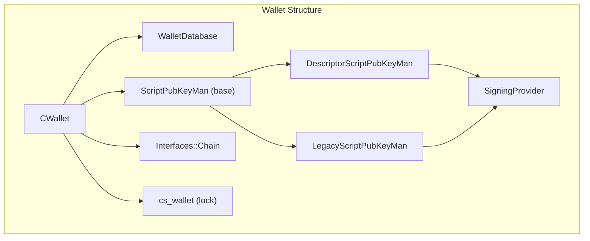

# Appendix: Quick Reference
## A. BIP Standards Summary ✅

| BIP | Name | Purpose |
|-----|------|---------|
| BIP32 | HD Wallets | Deterministic key derivation from seed |
| BIP39 | Mnemonic | Human-readable seed words |
| BIP44 | Multi-Account | Standard derivation paths |
| BIP84 | Native SegWit | Derivation for P2WPKH |
| BIP86 | Taproot Single Key | Derivation for P2TR key-path |
| BIP340 | Schnorr Signatures | Signature algorithm for Taproot |
| BIP341 | Taproot | Output and spending rules |
| BIP342 | Tapscript | Script rules for Taproot |

## B. Common Derivation Paths ✅

| Path | Network | Type |
|------|---------|------|
| m/44'/0'/0' | Mainnet | Legacy P2PKH |
| m/49'/0'/0' | Mainnet | Wrapped SegWit P2SH-P2WPKH |
| m/84'/0'/0' | Mainnet | Native SegWit P2WPKH |
| m/86'/0'/0' | Mainnet | Taproot P2TR |
| m/86'/1'/0' | Testnet/Signet | Taproot P2TR |

## C. Script Opcodes Reference ✅

| Opcode | Hex | Description |
|--------|-----|-------------|
| OP_0 | 0x00 | Push empty byte array |
| OP_1-OP_16 | 0x51-0x60 | Push numbers 1-16 |
| OP_RETURN | 0x6a | Marks output as unspendable |
| OP_DUP | 0x76 | Duplicate top stack item |
| OP_EQUAL | 0x87 | Compare top two items |
| OP_EQUALVERIFY | 0x88 | Equal then verify |
| OP_CHECKSIG | 0xac | Verify signature |
| OP_CHECKSIGADD | 0xba | Verify and add to counter (Tapscript) |
| OP_CHECKLOCKTIMEVERIFY | 0xb1 | Time/height lock (BIP 65) |
| OP_CHECKSEQUENCEVERIFY | 0xb2 | Relative time lock (BIP 68, 112) |

## D. Size Reference ✅

| Component | Size |
|-----------|------|
| Private key | 32 bytes |
| Public key (compressed) | 33 bytes |
| Public key (x-only) | 32 bytes |
| Schnorr signature | 64 bytes |
| P2TR output script | 34 bytes (OP_1 + push32 + key) |
| Outpoint | 36 bytes (txid + vout) |
| Value | 8 bytes |
| TXID | 32 bytes |

## E. Tagged Hash Tags ✅

| Tag | Usage |
|-----|-------|
| "TapLeaf" | Hash of a script in the Taproot tree |
| "TapBranch" | Combine two child hashes |
| "TapTweak" | Compute the tweak value |
| "TapSighash" | The signature message |
| "BIP0340/challenge" | Schnorr signature challenge |
| "BIP0340/aux" | Auxiliary randomness |
| "BIP0340/nonce" | Nonce generation |

---

## F. Glossary (Validated Against bitcoincore.academy) ✅

| Term | Definition |
|------|------------|
| **UTXO** | An unspent transaction output that can be spent as an input in a new transaction with a valid `ScriptSig` |
| **Mempool** | Collection of valid transactions learned from P2P network but not yet confirmed in a block |
| **Confirmation** | Once a transaction is included in a block, it has one confirmation. Six or more is considered sufficient proof that a transaction cannot be reversed |
| **Consensus** | When several nodes have the same blocks in their locally-validated best block chain |
| **Consensus Rules** | The block validation rules that full nodes follow to stay in consensus |
| **Script** | Bitcoin uses a scripting system that is Forth-like, simple, stack-based, and processed left to right. Purposefully not Turing-complete |
| **ScriptPubKey** | Script included in outputs which sets conditions for spending those satoshis |
| **ScriptSig** | Data generated by a spender to satisfy a pubkey script |
| **HD Protocol** | Hierarchical Deterministic key creation and transfer protocol (BIP-32) |
| **CKD** | Child key derivation functions - compute child extended key from parent and index |
| **PSBT** | Partially Signed Bitcoin Transaction format (BIP 174, BIP 370) |
| **CPFP** | Child-Pays-For-Parent - pay high fee to incentivize confirming parent transaction |
| **RBF** | Replace-by-fee - replacements must pay for their own cost plus the fee of replaced transactions |
| **Dust** | An output so small that spending it costs more in fees than it's worth |

## G. Wallet Component Structure ⚠️

Per bitcoincore.academy/components-overview.html:

| Component | Purpose |
|-----------|---------|
| **WalletDatabase** | Represents a single wallet, handles reads/writes to disk |
| **ScriptPubKeyMan** | Base class for SPKM implementations |
| **DescriptorScriptPubKeyMan** | SPKM for descriptor-based wallets |
| **LegacyScriptPubKeyMan** | SPKM for legacy wallets |
| **SigningProvider** | Interface for a KeyStore to sign transactions from |
| **Interfaces::Chain** | Access to chain state, fee rates, notifications, tx submission |
| **cs_wallet** | Primary wallet lock for atomic operations |

---

## H. Learning Path Recommendations ✅

### Beginner Path
1. Read Part I (Architecture) to understand how Bitcoin Core works
2. Read Chapter 7 (Transaction Structure) to see what transactions contain
3. Read Chapter 3 (Hashing) to understand the cryptographic building blocks
4. Practice: Use `bitcoin-cli` to explore real transactions

### Intermediate Path
1. Complete Beginner Path
2. Read Part III (Key Management) for wallet concepts
3. Read Chapter 8 (Scripts) to understand spending conditions
4. Read Chapter 12 (Coin Selection) for practical wallet operations
5. Practice: Build a simple wallet that can scan and report balances

### Advanced Path
1. Complete Intermediate Path
2. Read Part V (Taproot) in depth
3. Study Chapter 10 (BIP341 Signatures) carefully
4. Read Chapter 11 (Tapscript) for script-path spending
5. Practice: Implement full Taproot key-path and script-path spending

---

*This curated guide was validated against [bitcoincore.academy](https://bitcoincore.academy/) on January 30, 2026. For the most current information, always consult the official Bitcoin Core documentation and source code.*
