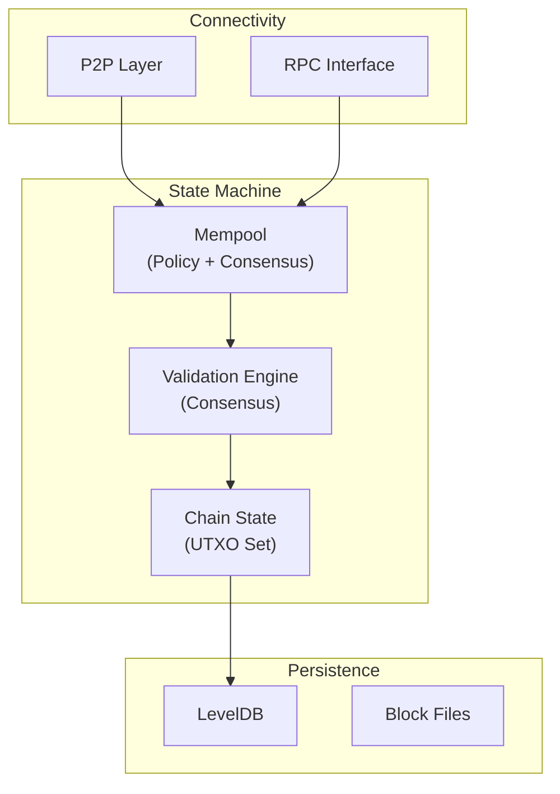
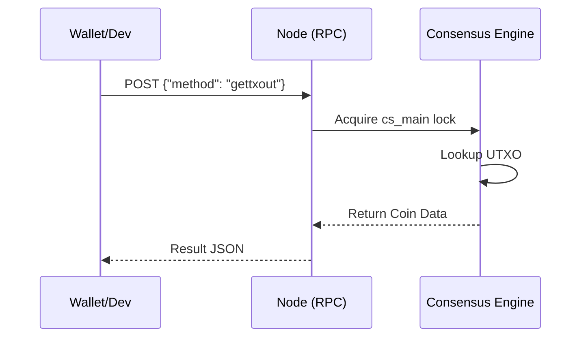
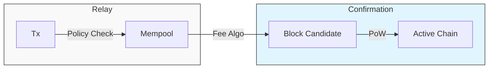

# Part I: Bitcoin Core Architecture

## Chapter 1: The System Model

Bitcoin Core is the reference implementation of the protocol. For the developer, it serves as the authoritative state machine. It maintains the ledger, validates state transitions (transactions), and propagates data to the peer-to-peer network.

### 1.1 Separation of Concerns

The architecture strictly separates **Consensus** (immutable network rules) from **Policy** (local node hygiene). This ensures that while individual nodes may reject spam (Policy), they all agree on the ledger state (Consensus).

### 1.2 The RPC Contract

The JSON-RPC interface is the developer's bridge to the node. Unlike modern REST APIs, it is synchronous and strictly typed. It acts as a trusted interface, allowing the wallet software to query state and broadcast signed transactions.

*   **Synchronous**: The node processes requests sequentially per worker thread.
*   **Method-Based**: Interactions are defined by commands (e.g., `getblocktemplate`, `sendrawtransaction`).

---

## Chapter 2: Operational Environment

### 2.1 Signet: Deterministic Development

To develop robust solutions, we require a stable environment. Mainnet is expensive; Testnet is chaotic. **Signet** (BIP 325) offers a centralized consensus mechanism on top of the Bitcoin codebase, mimicking Mainnet's topology but with predictable block generation.

*   **Stability**: No block storms or deep reorgs.
*   **Access**: Free coins for testing complex flows.
*   **Validation**: Identical script validation rules to Mainnet.

### 2.2 Data Propagation Flow

Data moves through the node in two phases: **Relay** (unconfirmed) and **Mining** (confirmed).

---

#### References
*   *Bitcoin Core Architecture Overview*
*   *BIP 325: Signet*
*   *Bitcoin RPC API Reference*
