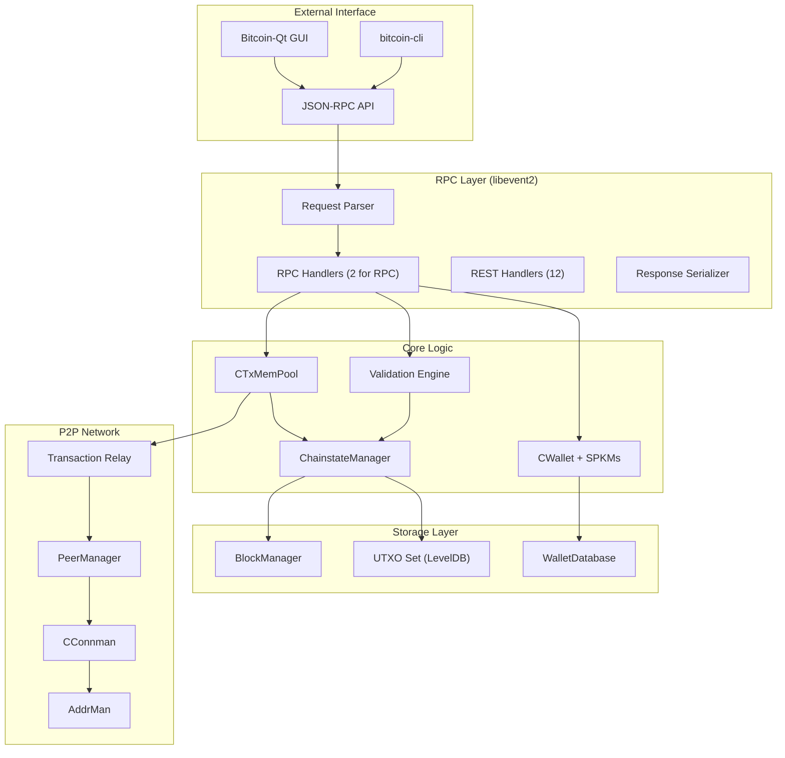
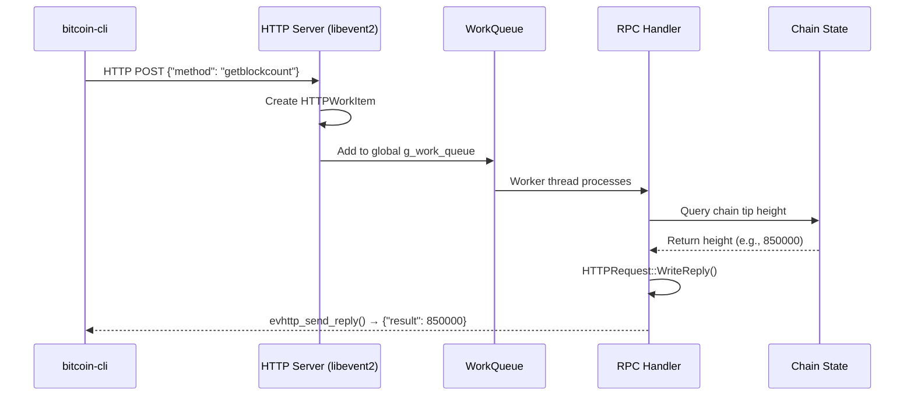
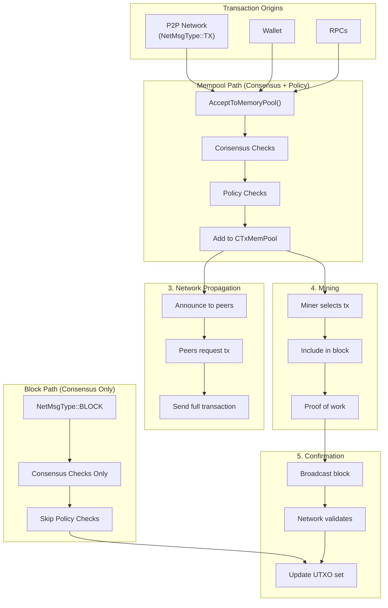
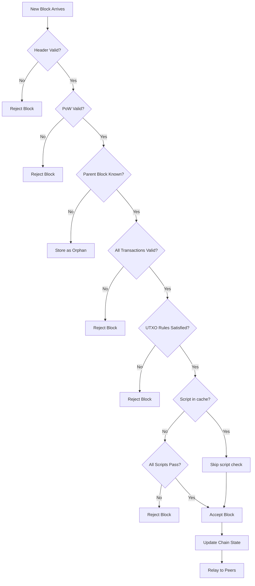

# Part I: Bitcoin Core Architecture

## Chapter 1: The Bitcoin Core Node ✅

Bitcoin Core is the reference implementation of the Bitcoin protocol. It serves as the "Source of Truth" for what is considered a valid transaction or block. Understanding the node's internal structure is critical because it explains the performance limitations and safety guarantees you must navigate as a developer.

Historically, Bitcoin Core started as a monolithic C++ application where most logic resided in a single file (`main.cpp`). Over the last decade, it has evolved into a highly modular system of libraries, separated to improve testing, security, and build times.

### 1.1 Layered Architecture ⚠️

The node is divided into distinct functional areas. The **P2P Layer** handles the noisy reality of the internet—connecting to peers and relaying data. The **Validation Engine** (Consensus) applies the strict rules of Bitcoin to everything the P2P layer receives. The **Storage Layer** persists this validated data efficiently to disk, while the **RPC Layer** provides a gateway for external applications to query state or submit new transactions.



### 1.2 The RPC Interface ✅

The RPC (Remote Procedure Call) interface is the primary way developers interact with a running node. Unlike a simple REST API, the RPC server is designed for high-integrity interaction with the local process. Internally, Bitcoin Core uses `libevent2` to handle incoming HTTP requests asynchronously across multiple worker threads.

When you issue a command, it is parsed into a request object, placed into a global work queue (`g_work_queue`), and picked up by the next available worker thread to be executed against the core logic pointers.



### 1.3 Bitcoin Core Source Organization ⚠️

Navigating the `bitcoin/src/` directory requires understanding the internal library dependencies. The codebase is organized to prevent circular dependencies, with specialized libraries for consensus, networking, and wallet management.

> **Note**: For developers, the `consensus/` folder is the most sacred, as any change there could accidentally fork your node away from the rest of the network.

```
bitcoin/src/
├── rpc/                    # RPC handlers (your external interface)
├── consensus/              # libbitcoin_consensus.a (standalone layer)
├── wallet/                 # libbitcoin_wallet.a (terminal dependency)
├── script/                 # Script interpreter and standard patterns
├── node/                   # libbitcoin_server.a (main node logic)
├── util/                   # General utility functions
└── net/                    # P2P and connection management
```

### 1.4 Signet: The Developer's Testnet ✅

Developing on the live Bitcoin network (Mainnet) is expensive and risky. Traditional Testnet is often "unstable" because blocks can be mined very quickly (block storms) or very slowly. **Signet** solves this by using a centralized "signing" authority to produce blocks at predictable 10-minute intervals. This gives developers a stable, free environment that perfectly mimics the behavior of Mainnet without the volatility.

---

## Chapter 2: Data Flow Through Bitcoin Core

### 2.1 Transaction Lifecycle ⚠️

Every transaction undergoes two distinct types of checks: **Consensus** and **Policy**. Consensus rules (e.g., "no double spending") are eternal and shared by all nodes. Policy rules (e.g., "minimum fee rate") are local preferences that help nodes protect their resources (RAM and CPU) from spam.

A transaction enters the system either from your wallet, an RPC call, or the P2P network. It must pass `AcceptToMemoryPool()` before it is eligible to be broadcast to other peers or included in a block by a miner.



### 2.2 Block Validation Process ⚠️

When a new block arrives, the node must perform a cascade of checks. The most expensive part of this is verifying every signature in every transaction. To optimize this, Bitcoin Core uses a **Script Cache**. If a transaction was already validated when it entered the mempool, the node remembers its validity and skips the duplicate work when that transaction finally appears in a block.


