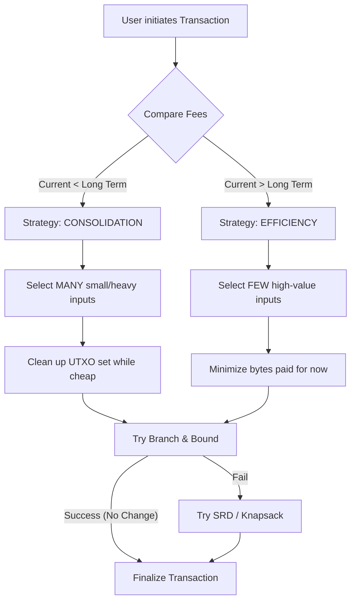

# Part III: Key Management & Wallets

## Chapter 7: Advanced Coin Selection

Coin Selection is often misunderstood as simply "finding enough money to pay." In reality, it is a complex **multi-objective optimization problem** that wallet software must solve every time a user sends a transaction.

The wallet must balance three often contradictory goals:
1.  **Minimizing Fees**: Paying the lowest possible transaction fee *now*.
2.  **Maximizing Privacy**: Avoiding patterns that reveal the user's total wealth or link unrelated payments.
3.  **UTXO Set Health**: Managing the wallet's future costs (e.g., avoiding "dust" accumulation or consolidating small outputs when fees are cheap).

This chapter details the modern "Hybrid" approach used by Bitcoin Core and advanced wallets.

---

### 7.1 The Cost of Money: Effective Value

The nominal value of a UTXO (e.g., 1000 sats) is not its spendable value. Every UTXO imposes a weight cost to be included in a transaction.

$$ 
\text{Effective Value} = \text{Amount} - (\text{Input Weight} \times \text{Current Fee Rate}) 
$$ 

If the cost to spend a UTXO exceeds its amount, it is considered **Uneconomical** or "Dust" at that fee rate. Smart wallets should avoid selecting these "toxic" coins during high-fee periods.

| Input Type | Weight (WU) | vBytes (approx) | Cost @ 10 sat/vB | Cost @ 100 sat/vB |
| :--- | :--- | :--- | :--- | :--- |
| **Legacy (P2PKH)** | ~592 | ~148 | 1,480 sats | 14,800 sats |
| **SegWit (P2WPKH)** | ~272 | ~68 | 680 sats | 6,800 sats |
| **Taproot (P2TR)** | ~230 | ~57.5 | 575 sats | 5,750 sats |

*Note: SegWit upgrades significantly increased the Effective Value of small UTXOs.*

---

### 7.2 The Gold Standard: The Waste Metric

How do we decide which combination of inputs is "best"? Bitcoin Core uses a metric called **Waste**. The algorithm compares different input sets and selects the one with the lowest Waste score.

$$ 
\text{Waste} = \text{Timing Waste} + \text{Change Cost} 
$$ 

#### A. Timing Waste (The Opportunity Cost)
This component asks: *"Is it cheaper to spend these inputs now, or should I wait?"*
*   **High Fees Now**: Spending heavy inputs (Legacy) generates positive waste (bad).
*   **Low Fees Now**: Spending heavy inputs generates negative waste (good/savings), effectively acting as **Consolidation**.

$$ 
\text{Timing Waste} = \text{Input Weight} \times (\text{Current Fee Rate} - \text{Long Term Fee Rate}) 
$$ 

#### B. Change Cost (The Creation Cost)
Creating a "Change Output" (returning the difference to yourself) is expensive:
1.  **Immediate Cost**: You pay fees for the bytes of the change output itself.
2.  **Future Cost**: You create a new UTXO that you will have to pay to spend later.
3.  **Privacy Cost**: Change outputs often link transactions and reveal the payment amount.

**Change Avoidance** is a primary goal of modern algorithms. If we can find inputs that sum exactly to the target (or close enough that the excess is less than the cost of creating change), we drop the change output entirely.

---

### 7.3 Selection Strategies (The Hybrid Approach)

A robust wallet doesn't rely on a single algorithm. It runs a competition between several strategies and picks the winner based on the Waste Metric.

#### 1. Branch and Bound (BnB)
*   **Goal**: Change Avoidance (Match Target Exactly).
*   **Mechanism**: A depth-first search exploring combinations of UTXOs to find a set where:
    $$ 
    \text{Target} \le \text{Total} \le \text{Target} + \text{Change Cost} + \text{Dust Threshold} 
    $$ 
*   **Result**: If successful, this transaction has **No Change Output**. Maximum privacy and efficiency.

#### 2. CoinGrinder (Weight Minimization)
*   **Goal**: Minimize transaction size (vBytes).
*   **Use Case**: High-fee environments.
*   **Mechanism**: It specifically looks for smaller, lighter inputs (like SegWit/Taproot) to reach the target amount with the smallest footprint.

#### 3. Single Random Draw (SRD)
*   **Goal**: Privacy via randomness.
*   **Mechanism**: Randomly selects UTXOs until the target is met.
*   **Role**: The "fallback" strategy. If BnB fails (cannot find an exact match) and other strategies are too expensive, SRD ensures the transaction can still proceed, albeit with a change output. It also breaks deterministic patterns that chain analysis firms look for.

---

### 7.4 Strategic Behavior

The wallet changes its behavior based on the fee environment:



### 7.5 Glossary

| Term | Definition |
| :--- | :--- |
| **vByte (Virtual Byte)** | The billable unit of transaction size. In SegWit, 1 vByte = 4 Weight Units (WU). |
| **Dust Threshold** | The minimum value an output must have to be propagated by the network. Amounts below this (e.g., 546 sats) are considered "spam". |
| **Long Term Fee Rate** | An estimate (e.g., 1000-block rolling average or 24h floor) of the "normal" fee. Used to detect if fees are currently high or low. |
| **Knapsack Problem** | The combinatorial optimization problem that BnB attempts to solve: packing the "knapsack" (transaction) with items (UTXOs) to reach a specific value. |

---

### 7.6 References & Further Reading

To deepen your understanding, refer to these canonical resources:

1.  **Murch's Master Thesis (The "Bible" of Coin Selection)**
    *   Written by the author of Bitcoin Core's current algorithm. It explains BnB and the Waste Metric in detail.
    *   [Read PDF](https://murch.one/wp-content/uploads/2016/11/erhardt2016coinselection.pdf)

2.  **Bitcoin Optech: Coin Selection**
    *   A high-level technical summary of the topic.
    *   [Visit Optech](https://bitcoinops.org/en/topics/coin-selection/)

3.  **BIP 141 (SegWit)**
    *   Essential for understanding the weight calculation: `Weight = Base + 3 * Witness`.
    *   [Read BIP 141](https://github.com/bitcoin/bips/blob/master/bip-0141.mediawiki)

4.  **CoinGrinder Implementation**
    *   The strategy for high-fee environments is based on this Bitcoin Core Pull Request.
    *   [Bitcoin Core PR #27877](https://github.com/bitcoin/bitcoin/pull/27877)

```