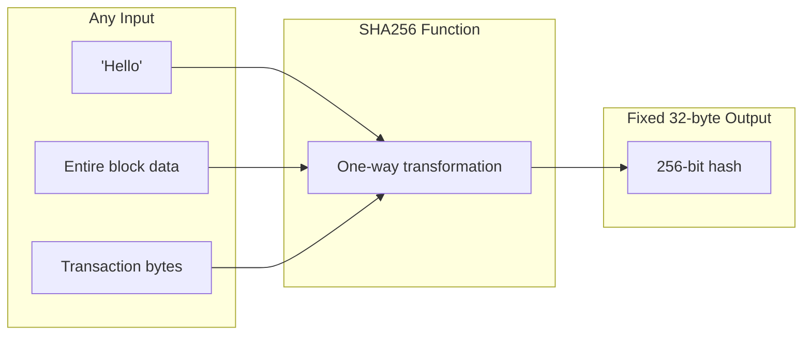
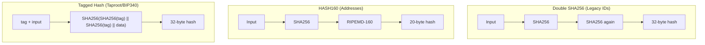
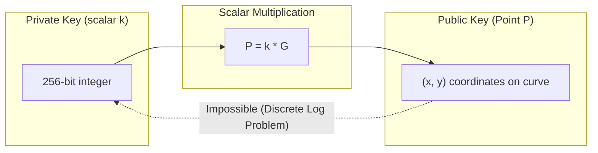
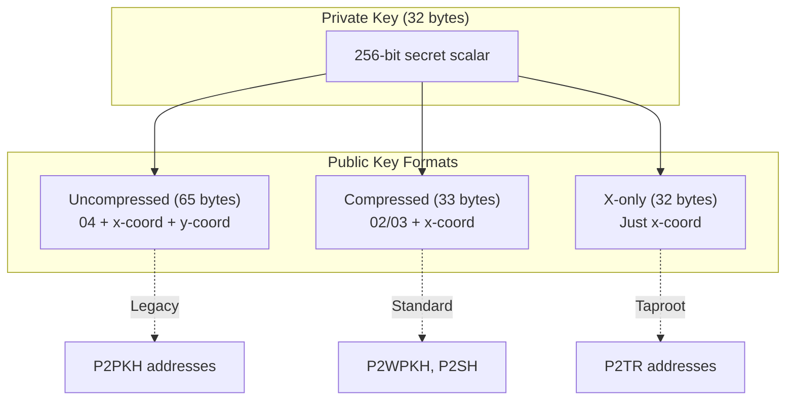

# Part II: Cryptographic Foundations

## Chapter 3: Hash Functions in Bitcoin

### 3.1 The Role of Hashing

At its core, Bitcoin is a giant chain of hash commitments. Hash functions allow us to take huge amounts of data (like a 2MB block) and represent it as a tiny, unique 32-byte string. This fingerprint is **deterministic** (always the same for the same data) and **one-way** (you can't reconstruct the block from the hash).

These properties are what make the blockchain immutable: if you change a single bit in a transaction, its hash changes, which changes the block's hash, which breaks the connection to every subsequent block in the chain.

The primary workhorse of Bitcoin is **SHA-256** (Secure Hash Algorithm, 256-bit). It is used for Proof-of-Work, Merkle Trees, and transaction identifiers.

### 3.2 The Hashing Zoology: SHA256, HASH160, and Tagged Hashes

Bitcoin uses specific variations of hashing for different security goals and constraints.

#### Double SHA-256 (`hash256`)
Almost all "IDs" in Bitcoin (TXIDs, Block Hashes) are calculated using a double round of SHA-256: `SHA256(SHA256(data))`.
Satoshi originally designed this to mitigate "Length Extension Attacks," a vulnerability present in the SHA-2 family. While modern analysis suggests it might be overkill for certain uses, it remains the standard for object identification.

#### HASH160 (`ripemd160(sha256(data))`)
Public Keys are rarely stored directly on-chain in legacy outputs. Instead, we store their hash to save space (20 bytes vs 33 bytes) and add a layer of quantum resistance (if ECDSA is broken, your key is safe until you spend).
`HASH160` combines SHA-256 with **RIPEMD-160**.
*   *Legacy Addresses (P2PKH)*: start with `1...` and encode a 20-byte HASH160.
*   *Nested SegWit (P2SH)*: start with `3...` and encode a 20-byte HASH160 of a script.

#### Tagged Hashing (BIP 340)
Modern upgrades like Taproot use **Tagged Hashing**, which prepends a domain-specific tag to the data. This prevents "collision" attacks where a valid signature in one context (e.g., a transaction) might be accidentally valid in another (e.g., a customized Merkle branch).
Formula: `SHA256(SHA256(tag) || SHA256(tag) || data)`

---

## Chapter 4: Elliptic Curve Cryptography

### 4.1 The `secp256k1` Curve

Bitcoin does not use standard RSA encryption. It uses Elliptic Curve Cryptography (ECC) over a specific finite field defined by the curve `secp256k1`.
The equation is simple: $y^2 = x^3 + 7$ over a finite field of prime order $p$.

The security relies on the **Discrete Logarithm Problem**:
*   **Addition**: Given a point $G$, calculating $G + G = 2G$ is easy.
*   **Scalar Multiplication**: Calculating $k * G$ (adding $G$ to itself $k$ times) is efficient.
*   **Division**: Given $P = k * G$, finding the scalar $k$ is computationally infeasible.

### 4.2 Keys: Analysis of Ownership

In Bitcoin, "ownership" is knowledge.

*   **Private Key ($k$)**: A 256-bit random integer. It must be selected from a specific range (slightly less than $2^{256}$). This is the user's secret.
*   **Public Key ($P$)**: The coordinate on the curve resulting from $P = k * G$. Since the generator point $G$ is a constant known to everyone, the Public Key is strictly derived from the Private Key.

### 4.3 Key Serialization Formats

How we store these mathematical points matters for blockchain efficiency.

#### Uncompressed Keys (Legacy)
Originally, keys were stored as the full $(x, y)$ coordinate pair, prefixed with `0x04`. This took **65 bytes**.

#### Compressed Keys (Standard)
Since $y^2 = x^3 + 7$, if we know $x$, we can calculate $y$ (there are only two possible solutions: positive/negative, or technically even/odd).
Compressed keys store only the $x$ coordinate and a distinct prefix (`0x02` if $y$ is even, `0x03` if odd). This reduces size to **33 bytes**.

#### X-Only Keys (Taproot)
With BIP 340 (Schnorr), we implicitly assume the $y$ coordinate is even. If the math results in an odd $y$, we negate the key. This allows us to drop the prefix entirely, storing only the $x$ coordinate. Size: **32 bytes**.

