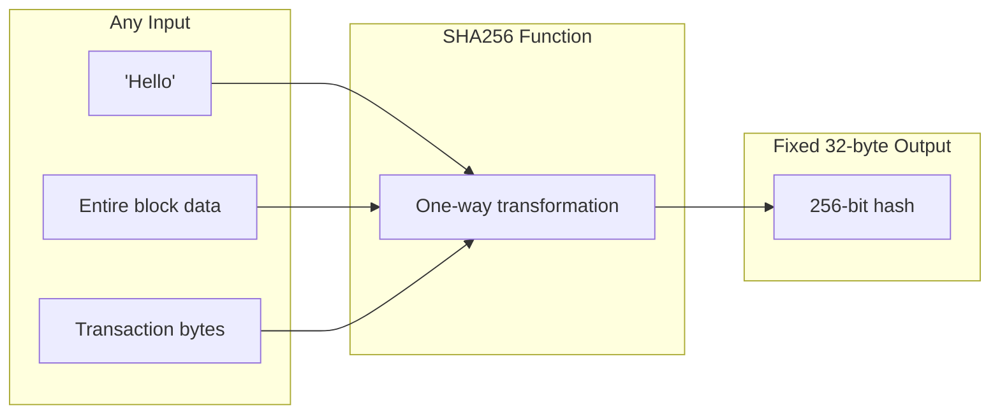
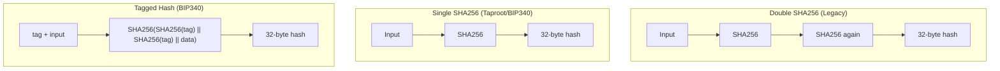
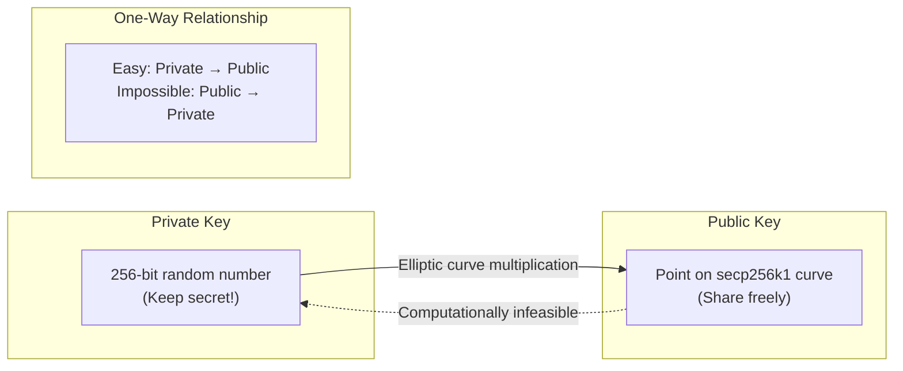
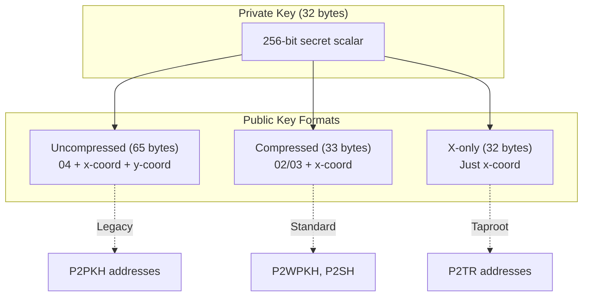

# Part II: Cryptographic Foundations

## Chapter 3: Hash Functions in Bitcoin ✅

### 3.1 The Role of Hashing ✅

At its core, Bitcoin is a giant chain of hash commitments. Hash functions allow us to take huge amounts of data (like a 2MB block) and represent it as a tiny, unique 32-byte string. This fingerprint is **deterministic** (always the same for the same data) and **one-way** (you can't reconstruct the block from the hash).

These properties are what make the blockchain immutable: if you change a single bit in a transaction, its hash changes, which changes the block's hash, which breaks the connection to every subsequent block in the chain.

### 3.2 Double SHA256 vs Single SHA256 ✅

Bitcoin uses different hashing strategies for different contexts. **Double SHA256** (hashing the hash) was originally used by Satoshi to protect against potential future vulnerabilities in a single SHA256 pass. Modern upgrades like Taproot use **Tagged Hashing**, which prepends a domain-specific tag to the data to prevent "cross-protocol" attacks where a signature from one part of the system might be valid in another.

---

## Chapter 4: Elliptic Curve Cryptography ✅

### 4.1 Keys Without the Math ✅

Elliptic Curve Cryptography (ECC) provides the "ownership" layer of Bitcoin. A **Private Key** is simply a secret random number. The **Public Key** is a coordinate on the `secp256k1` curve derived from that secret number. The "trapdoor" of ECC is that while it's easy to multiply a point to get a public key, it is mathematically impossible to "divide" to find the original secret number.

### 4.2 Key Formats in Bitcoin ✅

As Bitcoin evolved, key serialization became more efficient. Standard SegWit uses **Compressed Keys** (33 bytes), while Taproot introduces **X-only keys** (32 bytes). By assuming the "Y" coordinate of the point is always even, we can discard it entirely, saving space on the blockchain and simplifying signature verification.

