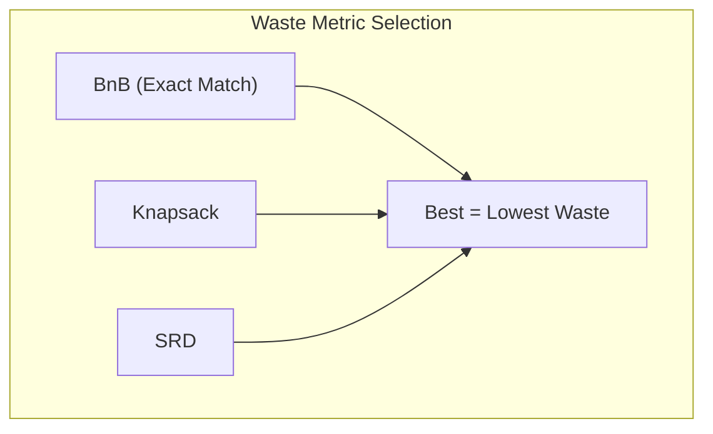

# Part VII: Practical Implementation Patterns

## Chapter 12: Coin Selection ⚠️

### 12.1 The Coin Selection Problem ✅

When you want to pay someone 0.1 BTC, your wallet might have dozens of UTXOs of various sizes (0.05, 0.2, 0.01...). **Coin Selection** is the algorithm that decides which specific "coins" to use. This is a variation of the "Knapsack Problem," but with an added twist: we must also consider the privacy implications of creating "change" and the cost (fees) of including more inputs.

### 12.3 The Three Algorithms ⚠️

Contrary to popular belief, Bitcoin Core uses three distinct strategies to find the best set of coins, choosing the one that results in the lowest **Waste Metric**.

1. **Branch and Bound (BnB)**: Tries to find an *exact match* for the payment so that no change output is needed. This is the most efficient for privacy and fees.
2. **Knapsack**: The legacy strategy that picks coins somewhat randomly to provide privacy.
3. **Single Random Draw (SRD)**: A simple fallback that picks coins until the target is met.



---

## Chapter 13: Transaction Building ⚠️

Building a transaction is a multi-step process that requires careful locking of the wallet state. Before selecting coins, the wallet must acquire the `cs_wallet` lock to ensure no other thread tries to spend the same coins at the same time. It then creates a "dummy" version of the transaction to calculate the exact size and fee, before finally producing the real signatures.

```mermaid
sequenceDiagram
    participant W as Wallet
    participant CS as Coin Selection
    participant SPKM as SPKM
    
    W->>W: Lock cs_wallet
    W->>CS: AvailableCoins()
    CS->>W: List Spendable UTXOs
    W->>CS: Choose via Waste Metric
    W->>SPKM: Sign for Inputs
    W->>W: testmempoolaccept
    W->>W: Broadcast

---

## Chapter 14: Blockchain Scanning & UTXO Accounting
> Source: [Bitcoin Core RPC Documentation](https://developer.bitcoin.org/reference/rpc/)

For watch-only wallets or indexers that do not rely on the built-in `CWallet` scanning, a custom blockchain traversal is required to calculate balances and track state.

### 14.1 The Scanning Loop
The most common pattern involves iterating through blocks sequentially via the RPC interface.
1.  **Block Hash**: Retrieve the hash for a specific height: `getblockhash <height>`.
2.  **Verbose Block**: Retrieve the full block data including transaction hexes: `getblock <hash> 2`.
3.  **Transaction Iteration**: Decode each transaction and inspect its inputs and outputs.

### 14.2 The UTXO Set Logic (Accounting)
To maintain an accurate balance, the application must manage a local set of **Unspent Transaction Outputs (UTXOs)**.

#### Input Processing (Gifts/Receiving)
For every output in a transaction:
1.  Compare the `scriptPubKey` against your list of derived addresses/programs.
2.  If it matches: 
    *   Add the amount to the total balance.
    *   Store the **Outpoint** (`txid:vout`) and its value in the local UTXO set.

#### Output Processing (Spending)
For every input in a transaction:
1.  Check if the input's `txid` and `vout` (Outpoint) exist in your local UTXO set.
2.  If it matches:
    *   Subtract the UTXO value from the total balance.
    *   Remove the Outpoint from the local UTXO set (it is now spent).

This "Double-Entry" style accounting ensures that the local balance reflects the on-chain reality without requiring a full node re-scan.
```
