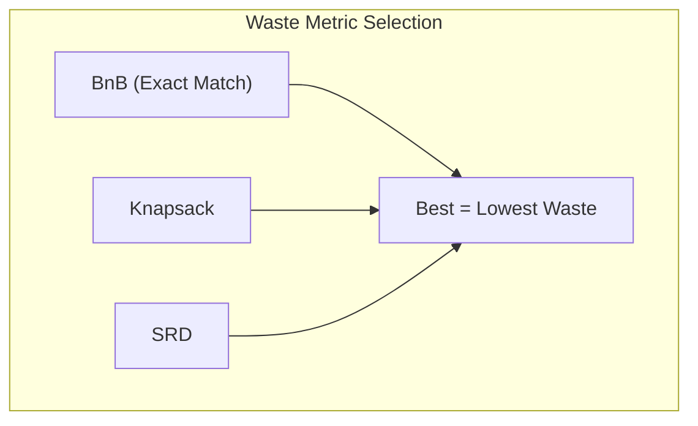
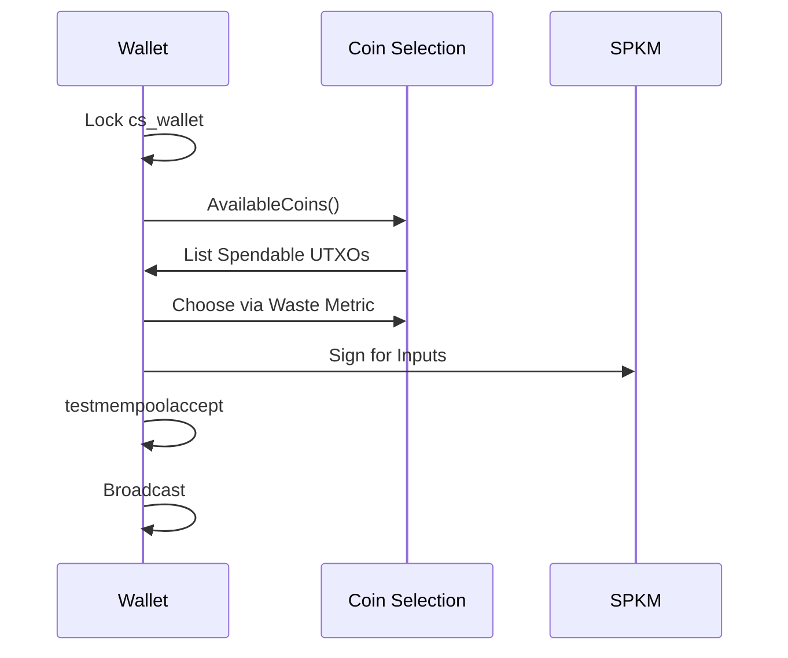

# Part VI: Practical Implementation Patterns

## Chapter 12: Coin Selection ⚠️

### 12.1 The Coin Selection Problem ✅

When you want to pay someone 0.1 BTC, your wallet might have dozens of UTXOs of various sizes (0.05, 0.2, 0.01...). **Coin Selection** is the algorithm that decides which specific "coins" to use. This is a variation of the "Knapsack Problem," but with an added twist: we must also consider the privacy implications of creating "change" and the cost (fees) of including more inputs.

### 12.3 The Three Algorithms ⚠️

Contrary to popular belief, Bitcoin Core uses three distinct strategies to find the best set of coins, choosing the one that results in the lowest **Waste Metric**.

1. **Branch and Bound (BnB)**: Tries to find an *exact match* for the payment so that no change output is needed. This is the most efficient for privacy and fees.
2. **Knapsack**: The legacy strategy that picks coins somewhat randomly to provide privacy.
3. **Single Random Draw (SRD)**: A simple fallback that picks coins until the target is met.

---

## Chapter 13: Transaction Building ⚠️

Building a transaction is a multi-step process that requires careful locking of the wallet state. Before selecting coins, the wallet must acquire the `cs_wallet` lock to ensure no other thread tries to spend the same coins at the same time. It then creates a "dummy" version of the transaction to calculate the exact size and fee, before finally producing the real signatures.

