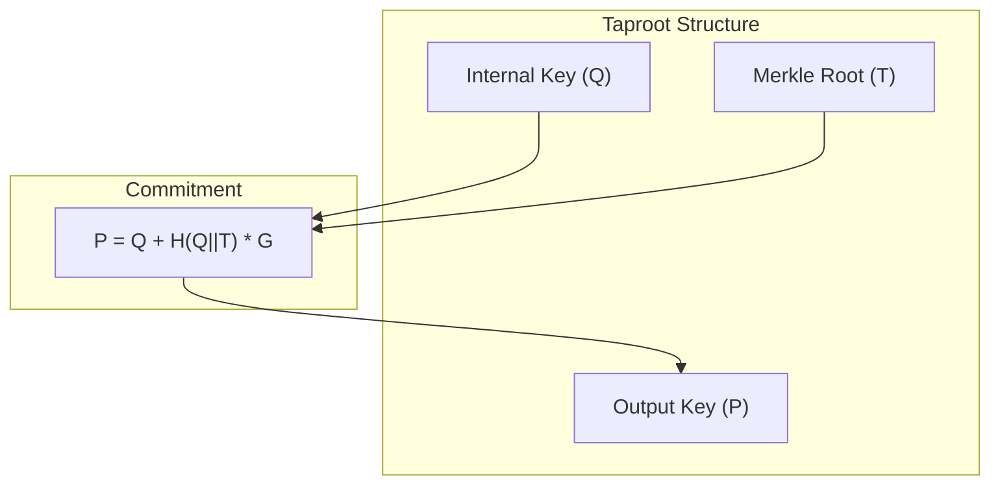
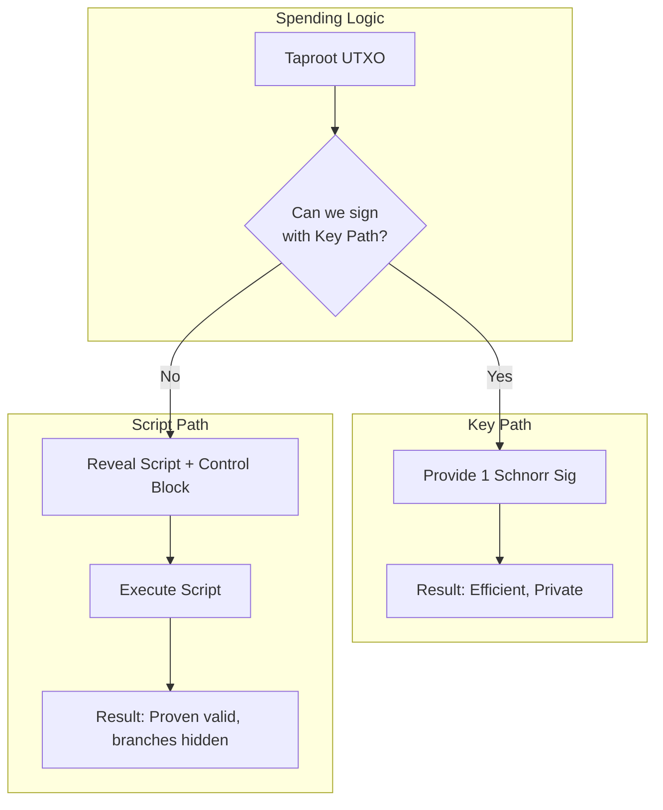
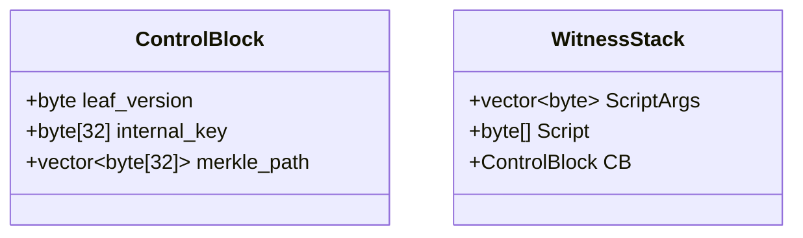

# Part VI: Taproot & Modern Bitcoin

## Chapter 9: The Taproot Architecture (BIP 340, 341, 342)

### 9.1 The Problem 

Before Taproot, complex scripts (like a Multisig combined with a Time-Lock) had to reveal all their conditions on-chain. This had two costs:
1.  **Privacy**: An observer could see you were using a complex setup.
2.  **Efficiency**: You paid fees for bytes (unused script branches) that were never executed.

**Taproot** unifies all outputs to look like a single public key. Whether it's a simple payment to Alice or a 100-person multisig with a time-lock backup, on-chain it looks like a standard `P2TR` output.

### 9.2 Schnorr Signatures (BIP 340)

Taproot introduces a new signature scheme. Unlike ECDSA, **Schnorr** signatures are linear.
*   **Property**: $Sig(Key_A) + Sig(Key_B) = Sig(Key_A + Key_B)$
*   **Implication (Key Aggregation)**: Multiple parties can combine their public keys into one aggregate key and sign jointly. The blockchain sees only *one* public key and *one* signature.

### 9.3 Merkle Abstract Syntax Trees (MAST)

Taproot allows us to commit to a **tree of scripts** without revealing the entire tree.
*   **Leaf**: A specific spending condition (e.g., "Alice can spend after Tuesday").
*   **Root**: The Merkle Root of all leaves.

We "hide" this root inside the public key itself using a commitment scheme.

### 9.4 Technical Implementation: Tweaking & Witness Programs
> Sources: [BIP 340 (Schnorr)](https://github.com/bitcoin/bips/blob/master/bip-0340.mediawiki) & [BIP 341 (Taproot)](https://github.com/bitcoin/bips/blob/master/bip-0341.mediawiki)

Implementing Taproot requires moving from 33-byte ECDSA public keys to 32-byte X-only Schnorr keys and applying a cryptographic "tweak."

#### 1. X-Only Public Keys (BIP 340)
Schnorr signatures in Bitcoin use only the X-coordinate of a point on the secp256k1 curve.
*   The Y-coordinate is implicitly assumed to be **even**.
*   If a derived public key has an odd Y, the private key `d` is negated (`n - d`) to ensure the resulting point has an even Y.

#### 2. The TapTweak (BIP 341)
The final on-chain public key `P` is a "tweaked" version of the internal key `Q`.
1.  **Internal Key (Q)**: The original 32-byte X-only key.
2.  **Tweak (t)**: `t = TaggedHash("TapTweak", Q || MerkleRoot)`.
    *   *Note: If there are no script paths, the MerkleRoot is omitted.*
3.  **Output Key (P)**: `P = Q + t*G`.
4.  **Private Key Update**: The spender must use the tweaked private key `p = q + t` (where `q` is the internal private key).

#### 3. Witness Program Construction
A Pay-to-Taproot (P2TR) output is defined by a specific Witness Program in the `scriptPubKey`:
*   **Version**: `0x51` (OP_1).
*   **Length**: `0x20` (32 bytes).
*   **Program**: The 32-byte Output Key `P`.
*   **Final Hex**: `5120<32_byte_P>`.

---

## Chapter 10: Spending Paths

A Taproot output can be spent in two ways. The spender chooses the path that grants the most privacy/efficiency for their situation.

### 10.1 Key Path Spend (The Happy Path)
If all parties agree (or if it's a single user), they can sign with the **Output Key (P)**.
*   **Mechanism**: They cooperate to create a Schnorr signature for the tweaked key.
*   **On-Chain Footprint**: One signature (64 bytes).
*   **Privacy**: Indistinguishable from a regular single-sig payment. The script tree remains hidden forever.

### 10.2 Script Path Spend (The Fallback)
If the Key Path is impossible (e.g., keys are lost, or parties disagree), a specific leaf from the tree can be used.
*   **Mechanism**:
    1.  Reveal the **Leaf Script**.
    2.  Reveal the **Control Block** (The Internal Key + Parity + Merkle Proof).
    3.  Provide the satisfying data (signatures, etc.) for that specific script.
*   **Privacy**: Only the utilized leaf is revealed. All other branches remain hidden.

---

## Chapter 11: Tapscript (BIP 342)

### 11.1 Updates to the Language
Tapscript is the name for the scripting language used in Taproot leaves.
1.  **Schnorr-Native**: `OP_CHECKSIG` now verifies Schnorr signatures (32-byte keys, 64-byte sigs).
2.  **`OP_CHECKSIGADD`**: Replaces `OP_CHECKMULTISIG`.
    *   *Legacy (SegWit v0)*: `OP_CHECKMULTISIG` was inefficient because it required the verifier to check every provided signature against potentially every public key until a match was found.
    *   *Tapscript*: `OP_CHECKSIGADD` assumes a 1-to-1 mapping. It consumes a signature and a counter. If the signature is valid for the corresponding public key, it increments the counter. This allows for linear batch verification and strictly enforced ordering.
3.  **Success Opcodes**: Any opcode strictly undefined is now `OP_SUCCESS`. If a node encounters `OP_SUCCESS`, the script effectively returns "True" immediately (for the upgrader). This allows future soft forks to introduce new logic without breaking old nodes.

### 11.2 The Control Block
When spending via script path, you must provide the **Control Block**. This data structure proves that the script you are executing is indeed committed inside the Output Key.
*   **Q (Internal Key)**: The starting point before the tweak.
*   **Merkle Path**: The hashes required to prove the script's inclusion in the root.
*   **Leaf Version**: Currently `0xC0` (Tapscript).

