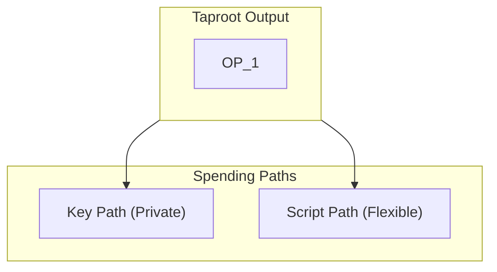
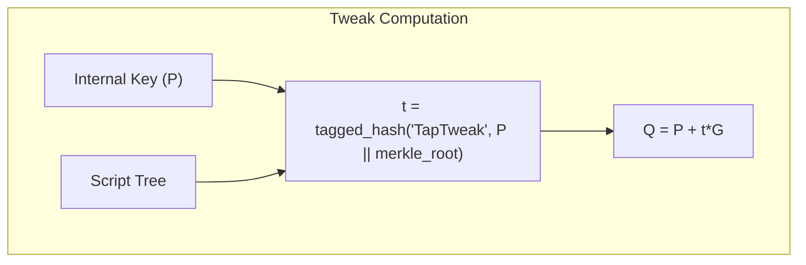
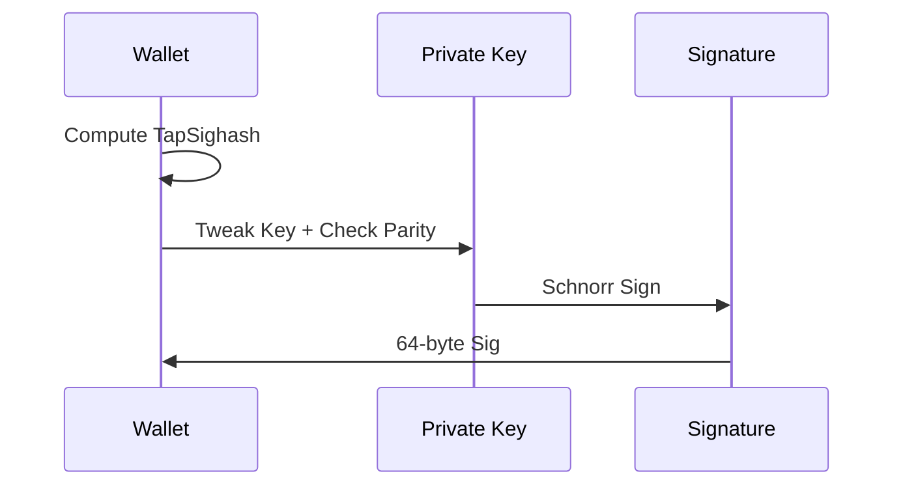
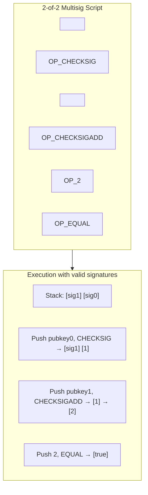

# Part V: Taproot & Modern Bitcoin

## Chapter 9: Understanding Taproot ✅

### 9.1 The Taproot Vision ✅

Taproot is the most significant upgrade to Bitcoin since SegWit. Its primary goal is privacy and efficiency through **Mast (Merkelized Alternative Script Trees)** and **Schnorr Signatures**. In Taproot, a user can have multiple ways to spend their money: a simple signature (Key Path) OR a complex set of conditions (Script Path). On-chain, a Key Path spend looks identical to any other Taproot spend, hiding the fact that other conditions even existed.

### 9.2 Taproot Key Structure ✅

The magic of Taproot lies in **Key Tweaking**. We take an "Internal Key" (P) and modify it by adding a hash of the "Script Tree" (T). The resulting "Output Key" (Q) commits to both the key and the scripts. To spend via the Key Path, you tweak your private key in the same way. To spend via the Script Path, you reveal the script and prove it was part of the original commitment.

---

## Chapter 10: Taproot Signatures (BIP341) ✅

### 10.1 The Commitment Hash ✅

Signing for Taproot requires a much more complex "Signature Hash" (Sighash) than legacy types. It includes references to all inputs and their values to prevent "fee-sniping" and other subtle attacks. This commitment hash is what the Schnorr algorithm actually signs.

### 10.2 Key Path vs Script Path Signing ✅

- **Key Path**: The wallet tweaks the private key, checks the Y-coordinate parity (negating the key if necessary), and creates a single 64-byte signature.
- **Script Path**: The wallet reveals the specific script, provides a Merkle proof (the Control Block), and signs with untweaked keys as defined in that script.

---

## Chapter 11: Tapscript (BIP342) ✅

### 11.1 New Opcodes for Taproot ✅

| Opcode | Behavior |
|--------|----------|
| `OP_CHECKSIG` | Pops pubkey and signature, pushes 1 if valid, 0 if invalid |
| `OP_CHECKSIGADD` | Pops pubkey, signature, and counter; pushes counter+1 if valid, counter if invalid |

### 11.2 Building a 2-of-2 Multisig in Tapscript ✅

