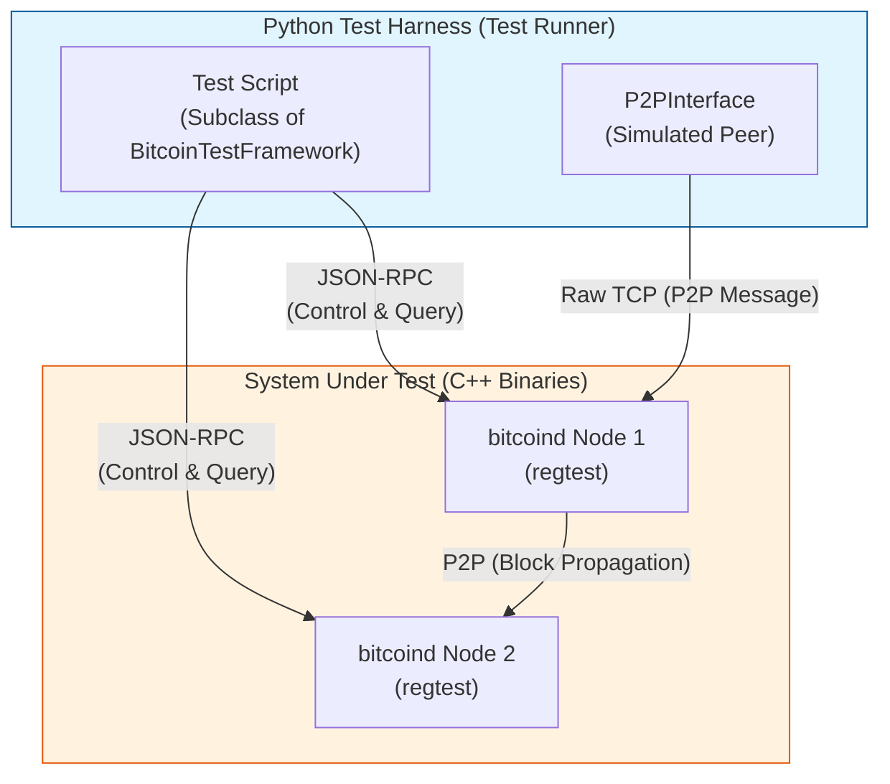

# Part VIII: The Bitcoin Core Test Framework

## Chapter 14: Simulation & Quality Assurance

> "The functional tests are the most effective way to understand how the system behaves as a black box—and how to break it."

### 14.1 The Philosophy of Testing Consensus

Bitcoin Core is not just software; it is a mechanism for reaching consensus. A bug in a web server might crash a page; a bug in Bitcoin Core can fracture the global financial ledger. As such, the testing methodology is rigorous, multilayered, and often adversarial.

The codebase employs multiple testing paradigms:
1.  **Unit Tests (C++)**: Test individual functions and classes in isolation (e.g., script interpretation, serialization).
2.  **Fuzz Testing**: Feeds random inputs to critical parsers to find edge cases.
3.  **Functional Tests (Python)**: The subject of this chapter. These test the node as a complete system, simulating the P2P network, RPC commands, and complex blockchain reorgs.

### 14.2 The Functional Test Architecture

The Functional Test Framework is a Python-based harness located in `test/functional/`. It does not link against the C++ code directly. Instead, it acts as a **Puppeteer**, spinning up compiled `bitcoind` binaries in separate processes and controlling them via standard interfaces.

#### The Test Controller

At the heart of every functional test is the `BitcoinTestFramework` class. When you write a new test, you inherit from this class. It handles:
-   **Lifecycle Management**: Starting and stopping `bitcoind` nodes.
-   **Network Layout**: Configuring how these nodes connect (e.g., linear topology, star topology).
-   **Chain Initialization**: Ensuring nodes start with a workable, deterministic blockchain state (usually regtest).

#### The Interface Bridge

The framework communicates with the nodes through two primary channels:

1.  **RPC (JSON-RPC)**: The primary control plane. The Python test script calls methods like `node.getblockchaininfo()` or `node.generate()`. These map directly to the `bitcoind` RPC interface.
2.  **P2P (The `mininode`)**: To test consensus rules properly, the test framework often needs to act as a *peer*. The `P2PInterface` allows the Python script to open a raw TCP socket to the node, complete the version handshake, and exchange binary Bitcoin messages (like `block`, `tx`, `inv`).

This dual-interface architecture allows the test to "cheat"—using RPC to inspect internal state—while simultaneously testing the node's reaction to valid (or invalid) network traffic via P2P.

### 14.3 The `BitcoinTestFramework` Flow

Every functional test follows a specific lifecycle method execution order. Understanding this flow is critical for modifying or writing tests.

1.  **`set_test_params()`**:
    -   Where you define the static configuration: number of nodes, specific command-line arguments (e.g., `-txindex`), and chain parameters.
    -   *Example*: "I need 3 nodes, and Node 0 needs `-persistmempool=0`."

2.  **`setup_network()` (Optional)**:
    -   The framework provides a default setup (connecting nodes in a line). You override this if you need a specific topology (e.g., a partition attack where Node 0 cannot see Node 2).

3.  **`run_test()`**:
    -   The main body of the specific test logic.
    -   Here, you generate blocks, send transactions, invalidate blocks to cause reorgs, and assert states.

#### Synchronization

One of the most complex aspects of distributed system testing is **state propagation**. When you generate a block on Node 0, Node 1 does not have it instantly.
The framework provides helper methods to handle this indeterminism:
-   `self.sync_all()`: Waits until all nodes have the same tip and same mempool.
-   `self.sync_blocks()`: Waits only for block convergence.
-   `self.wait_until()`: A polling loop that waits for a specific lambda condition to be true (e.g., "wait until Node 2 sees the transaction").

### 14.4 Manipulating State (The "Test The Test" Mindset)

To truly verify the system, we often need to introduce failure. The framework allows us to craft "invalid" scenarios that are impossible to produce with a standard client but trivial to construct with the P2P interface.

#### Script and Transaction Forgery
Using the P2P interface, you can construct a `CMsgTx` (the Python representation of a transaction) manually.
-   You can set the `nLockTime` to the future.
-   You can modify the `nSequence` to enable RBF (Replace-By-Fee).
-   You can build an invalid `scriptSig` or witness.

By sending this malformed transaction over the P2P connection, you verify that the node's **Validation Engine** correctly identifies and rejects it (preferably with a punishment score).

#### Block invalidation
The RPC command `invalidateblock(hash)` is a powerful tool for testing reorg logic. It tells the node to treat a specific valid block as invalid. This forces the node to:
1.  Disconnect the tip.
2.  Roll back the UTXO set.
3.  Resurrect mempool transactions.
4.  Reconsider the next best chain.

This is fundamentally how we test that the node can survive a consensus failure or a malicious fork.

### 14.5 Debugging the Test Harness

When a test fails, specific tools help diagnose the issue:

-   **Test Logs**: Found in the temporary test directory. The `test_framework.log` shows the Python side, while each node has its own `debug.log`.
-   **`--tracerpc`**: Running the test with this flag prints every JSON-RPC call to the console, allowing you to see exactly what data is moving between the harness and the nodes.
-   **`--pdbonfailure`**: Drops you into a Python debugger shell exactly at the moment an assertion fails. This allows you to inspect variables and the state of the nodes interactively.

### 14.6 Summary

The Bitcoin Core Functional Test Framework is a simulation engine. It allows developers to act as the "Network," orchestrating scenarios ranging from simple payments to complex consensus forks. Mastery of this framework—specifically the ability to effectively synchronize state and craft custom P2P messages—is the primary skill required to verify changes to the protocol.
