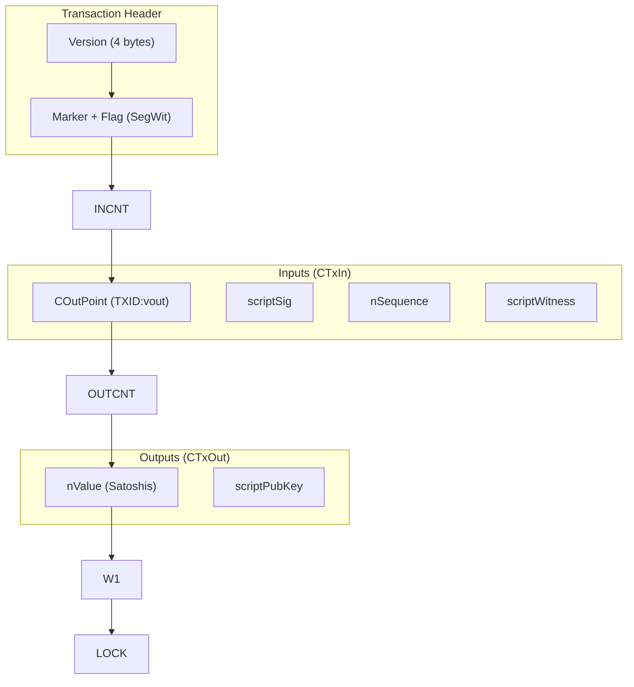
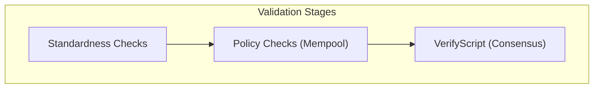

# Part IV: Transactions Deep Dive

## Chapter 7: Transaction Structure ✅

### 7.1 Anatomy of a Bitcoin Transaction ✅

A Bitcoin transaction is a data package that takes existing UTXOs (inputs) and re-locks them into new conditions (outputs). Every input must point back to a specific `COutPoint` (the TXID and index of a previous output) and provide a valid signature. Every output specifies an amount in Satoshis and a `scriptPubKey`, which contains the locking instructions.

### 7.2 SegWit: Separating Witness Data ✅

**Segregated Witness (SegWit)** was a revolutionary upgrade that moved the signature (witness) data out of the main transaction structure. This fixed a critical bug called "Transaction Malleability," where anyone could slightly change a signature and change the TXID of a transaction before it was confirmed. By pulling the witness out, the TXID remains stable, which is necessary for advanced technologies like the Lightning Network.

---

## Chapter 8: Script System ⚠️

### 8.1 Bitcoin Script Basics ✅

Bitcoin uses a "Forth-like" stack-based language. It is intentionally simple and **not Turing-complete**, meaning it has no loops. This is a security feature: it ensures that a script will always finish executing in a predictable amount of time, protecting the network from "infinite loop" denial-of-service attacks.

### 8.2 Execution and Validation Flow ⚠️

In modern Bitcoin (since 2010), the input and output scripts are not simply concatenated and run together. Instead, the input script is executed first, and the resulting "stack" is then passed to the output script. If the output script finishes with a "True" value on the stack, the transaction is valid.

