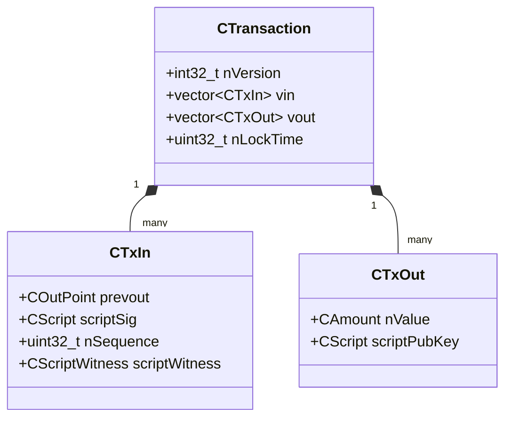
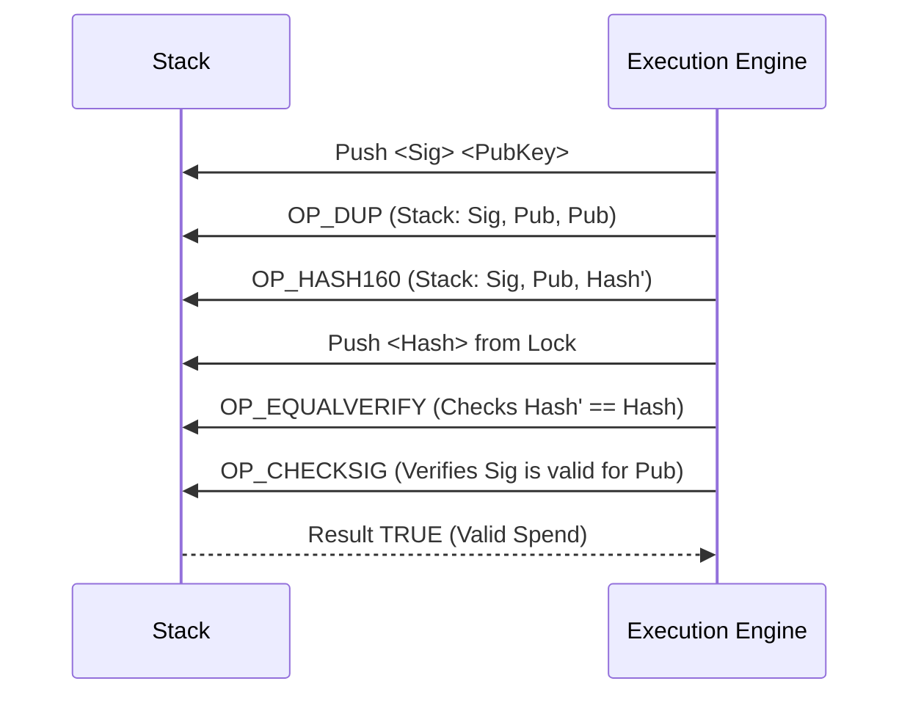

# Part IV: Transactions Deep Dive

## Chapter 7: The Data Structure of Value

### 7.1 Anatomy of `CTransaction`

A Bitcoin transaction is a **state transition**. It consumes specific Unspent Transaction Outputs (UTXOs) and creates new ones.
The C++ structure `CTransaction` (and its mutable counterpart `CMutableTransaction`) serializes the following fields:

1.  **Version (`nVersion`)**: 4 bytes. Currently `1` or `2` (BIP 68). Older versions indicate legacy rules; mostly used now to signal RBF eligibility.
2.  **Inputs (`vin`)**: A vector of `CTxIn`. Each input points to a previous output and provides the "key" to unlock it.
3.  **Outputs (`vout`)**: A vector of `CTxOut`. Each output defines the amount and the "lock" for the next owner.
4.  **LockTime (`nLockTime`)**: 4 bytes. If non-zero, the transaction is invalid until this block height or timestamp.
5.  **Witness Data**: (SegWit) The signatures and scripts, stored apart from the transaction ID calculation.

### 7.2 The SegWit Upgrade (BIP 141)

Before SegWit, signatures (`scriptSig`) were part of the data hashed to create the Transaction ID (TXID). This allowed for **Transaction Malleability**: a third party could re-encode a signature (e.g., adding a dummy operation) without invalidating it. The signature would verify, but the TXID would change.
*   *Result*: The sender wouldn't know if the payment succeeded, and second-layer protocols (Lightning) were impossible to build safely.

**The Solution**: SegWit moved witness data to a separate structure.
*   **TXID**: `SHA256(SHA256(legacy_data))` (Immutable identity)
*   **wTXID**: `SHA256(SHA256(legacy_data + witness))` (Network integrity)

---

## Chapter 8: The Script Interpreter

### 8.1 Stack-Based Execution

Bitcoin Script is a Forth-like, stack-based language. It is **Turing-incomplete** (no loops), ensuring every script terminates deterministically.
Language Mechanics:
*   **Data Pushed**: Constants (signatures, pubkeys) are pushed onto a stack.
*   **Operations (`OP_CODE`)**: Functions pop items, calculate, and push results back.

### 8.2 Standard Script Templates

While the language allows infinite creativity, nodes only relay "Standard" scripts (`IsStandard`).
1.  **P2PKH (Pay to PubKey Hash)**:
    `OP_DUP OP_HASH160 <PubHash> OP_EQUALVERIFY OP_CHECKSIG`
2.  **P2SH (Pay to Script Hash)**:
    `OP_HASH160 <ScriptHash> OP_EQUAL`
    (The actual script is provided in the input, not the output).
3.  **P2WPKH (Native SegWit)**:
    `0 <20-byte-hash>`
    (A "version 0" witness program).

### 8.3 Execution Example: P2PKH

Let's trace how a standard P2PKH transaction is validated.

**The Output (Lock)**:
`OP_DUP OP_HASH160 <Hash> OP_EQUALVERIFY OP_CHECKSIG`

**The Input (Key)**:
`<Signature> <PubKey>`

**Execution**:
1.  **Stack Init**: `<Sig> <PubKey>`
2.  **OP_DUP**: Duplicates top item. Stack: `<Sig> <PubKey> <PubKey>`
3.  **OP_HASH160**: Hashes top item. Stack: `<Sig> <PubKey> <PubHash_Calculated>`
4.  **Push `<Hash>`**: The lock's hash. Stack: `<Sig> <PubKey> <PubHash_Calculated> <PubHash_Lock>`
5.  **OP_EQUALVERIFY**: Checks equality. If proper, Stack: `<Sig> <PubKey>`
6.  **OP_CHECKSIG**: Verifies signature against PubKey. Result: `TRUE`

