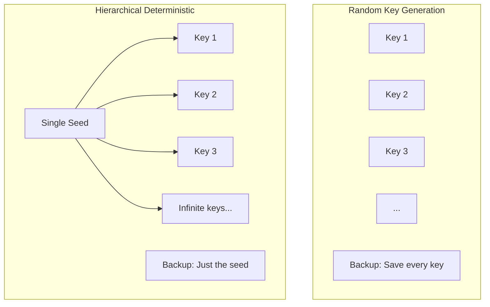
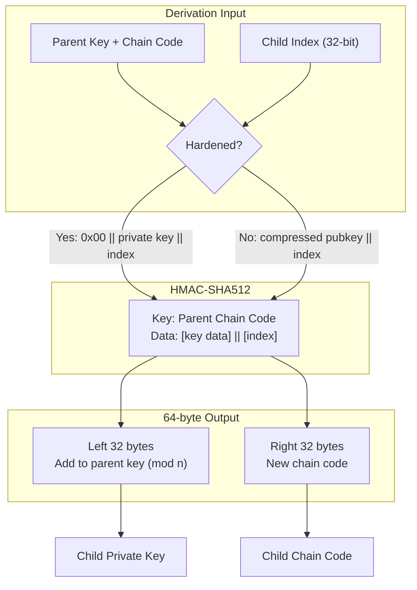
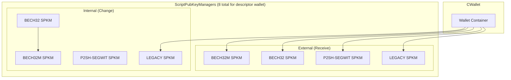
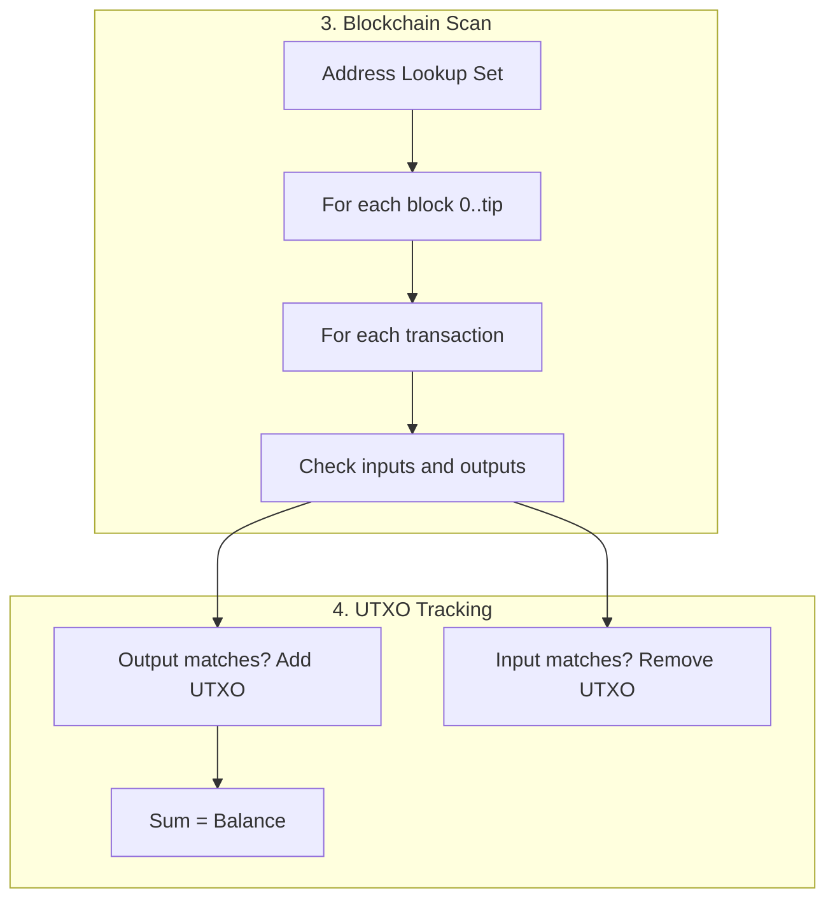

# Part III: Key Management & Wallets

## Chapter 5: Hierarchical Deterministic Wallets (BIP32) ✅

### 5.1 The Problem HD Wallets Solve ✅

In the early days of Bitcoin, every new address required a new random private key. If you lost your wallet file without backing up that *specific* key, your money was gone. **Hierarchical Deterministic (HD) Wallets** solved this by allowing an infinite number of keys to be derived from a single "Master Seed". One backup of 12 or 24 words can now recover your entire financial history forever.

### 5.2 Extended Keys and Derivation Algorithm ✅

An **Extended Key** (xprv or xpub) is a standard key plus a 32-byte **Chain Code**. The Chain Code acts as extra entropy that allows us to derive child keys without exposing the parent's private key.

**Hardened Derivation** (using the parent's private key) creates a firewall: even if a child key is compromised, it is mathematically impossible to climb back up and find the parent key. **Normal Derivation** allows an xpub to generate millions of child *public* keys, which is perfect for online shops that need a new address for every customer but never want to store a private key on a web server.

---

## Chapter 6: Wallet Architecture ⚠️

### 6.1 ScriptPubKeyManagers (SPKM) ⚠️

A modern Bitcoin wallet is actually a collection of specialized managers. Each `ScriptPubKeyMan` is responsible for a specific type of address (e.g., Taproot vs. Native SegWit). This modularity allows Bitcoin Core to support multiple address types simultaneously within the same wallet file while keeping the signing logic for each type isolated.

### 6.2 Legacy vs Descriptor Wallets ⚠️

Bitcoin has moved from "Legacy" wallets (storing raw keys in a pool) to **Descriptor Wallets**. Descriptors are scripts that perfectly describe how to derive keys and construct addresses. They are unambiguous and portable, meaning you can move a descriptor between different wallet software (like Core to Sparrow) and always arrive at the exact same addresses and balance.

### 6.3 Wallet Recovery & Blockchain Scanning ✅

Recovering a wallet is one of the most resource-intensive tasks a node performs. Because the blockchain doesn't store "balances," the wallet must generate a significant number of keys (the "gap limit," usually 2000), calculate their corresponding addresses, and then read every block in the blockchain's history to see if any of those addresses ever received or spent money.

