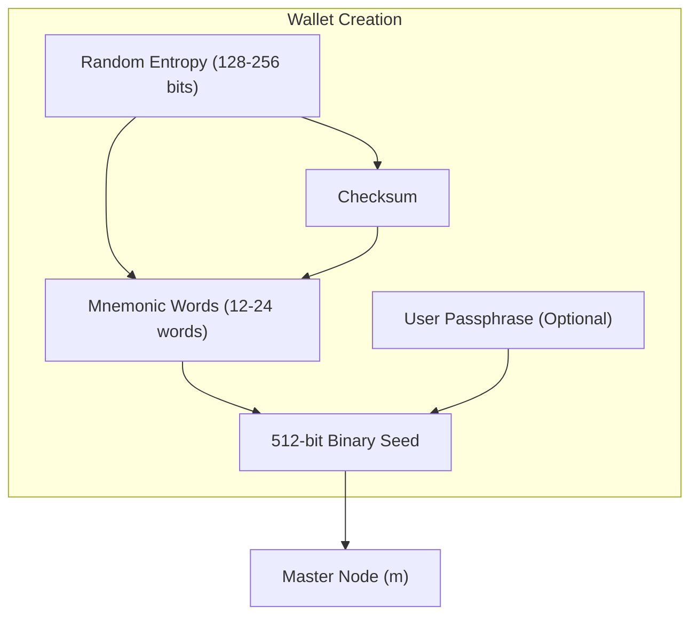
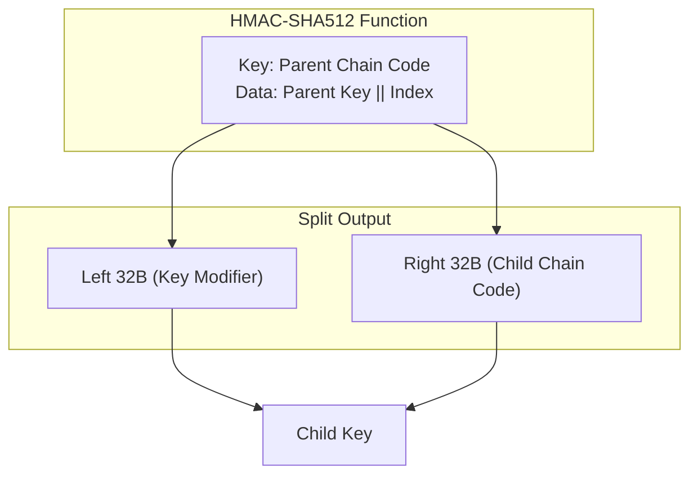
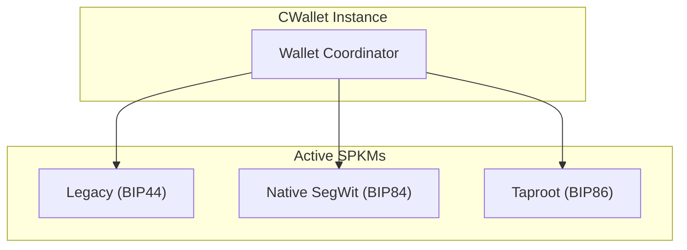
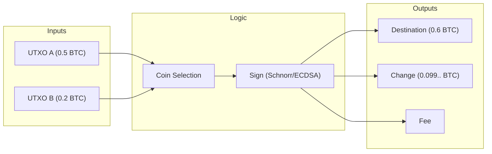

# Part III: Key Management & Wallets

## Chapter 5: HD Wallets & Standards (BIP32/39/44)

### 5.1 From Randomness to Determinism

In the early days of Bitcoin (the "Just a Bunch of Keys" or JBOK era), every new address required a new random private key. This was a nightmare for backups: if you generated 100 new addresses after your last backup, those funds were at risk.

**Hierarchical Deterministic (HD) Wallets (BIP 32)** solved this by creating a tree structure. A single **Master Seed** can mathematically derive an infinite tree of child keys.
1.  **Backup once**: Write down the seed.
2.  **Use forever**: Every future key is deterministically calculable from that seed.

### 5.2 Mnemonic Codes (BIP 39)
Humans are bad at remembering 256-bit binary numbers. BIP 39 standardized the conversion of entropy into a user-friendly list of words.
*   **Entropy**: You start with 128-256 bits of randomness.
*   **Checksum**: A hash is appended to detect typos.
*   **Mnemonic**: The bits are sliced into 11-bit chunks, each mapping to a word list (2048 words).
*   **Seed**: The mnemonic + an optional "passphrase" is hashed (PBKDF2) to produce the 512-bit Root Seed.

### 5.3 BIP 32: The Derivation Engine

BIP 32 defines how to move from a parent key to a child key. It introduces the **Extended Key** (`xprv` / `xpub`), which consists of:
1.  **Key**: The 33-byte compressed public or private key.
2.  **Chain Code**: A 32-byte "blinding factor" or extra entropy.

#### Normal vs. Hardened Derivation
*   **Normal Derivation (Index 0 to $2^{31}-1$)**: Can derive Child Public Key from Parent Public Key.
    *   *Pro*: Allows "Watch-Only" wallets (web servers can generate deposit addresses without spending keys).
    *   *Con*: If a child private key leaks AND the parent chain code is known, the parent private key can be calculated.
*   **Hardened Derivation (Index $2^{31}$ to $2^{32}-1$)**: Requires Parent Private Key.
    *   *Pro*: Firewall. Child key leakage typically cannot compromise the parent.
    *   *Con*: Cannot derive public keys hierarchy from an `xpub` alone.

### 5.4 Standard Derivation Paths
To ensure different wallets are compatible, we adhere to path standards (BIP 43/44).
Path structure: `m / purpose' / coin_type' / account' / change / address_index`
*   **Purpose**: The version of Bitcoin script (e.g., 44' for Legacy, 84' for SegWit, 86' for Taproot).
*   **Coin Type**: 0' for Bitcoin, 1' for Testnet.
*   **Account**: Logical separation of funds.
*   **Change**: 0 for external (receiving), 1 for internal (change addresses).

---

## Chapter 6: The Modern Core Wallet

### 6.1 Architecture: From `bitcoind` to `CWallet`

In Bitcoin Core, the wallet is modular. The central object `CWallet` manages the database (BerkeleyDB or SQLite) and orchestrates sub-components.

#### ScriptPubKeyManagers (SPKMs)
A single wallet can manage mixed script types. It does this via SPKMs. Each SPKM is responsible for a specific derivation path and script type.
*   A user upgrading to Taproot doesn't need a new wallet file; the wallet simply adds a new `BECH32M` SPKM to the existing container.

### 6.2 Output Descriptors

Legacy wallets were a "bag of keys." Modern Bitcoin Core wallets are **Descriptor Wallets**.
A descriptor is a human-readable string that unambiguously describes the script creation and key derivation.

Example Taproot Descriptor:
`tr([d34db33f/86'/0'/0']xpub.../0/*)#checksum`

This tells the wallet:
1.  `tr(...)`: We are using Taproot outputs (P2TR).
2.  `[...]`: The source key fingerprint and derivation path (for hardware wallet verification).
3.  `/0/*`: We are generating receiving addresses (index 0) sequentially (*).

### 6.3 Transaction Building & Coin Control

The wallet is not just a key storage; it is a transaction factory.
1.  **Coin Control**: The user (or algorithm) selects specific UTXOs to spend.
2.  **Fee Estimation**: The wallet queries the node's mempool to calculate the sat/vbyte needed for confirmation.
3.  **Change Handling**: If inputs > target amount, the wallet generates a change address (via the Internal chain of the correct SPKM) to receive the remainder.

